# version5 results: hybrid activations under a corrected protocol

Protocol: MLP 784→H→H→10, batch-size-1 SGD, 10 epochs, fixed 45k/5k/10k train/val/test split shared by all runs, per-epoch shuffling, He/Kaiming-uniform init. Hidden layers carry per-neuron activation masks; the output layer is uniform (linear+softmax with cross-entropy, or sigmoid with MSE). Learning rate chosen per configuration on validation accuracy using three calibration seeds (101–103) that are disjoint from the evaluation seeds. All comparisons are paired by seed. Bootstrap CIs use 10,000 resamples.

## 1. MNIST, 12 hidden neurons, cross-entropy (20 seeds per config)

| config | lr | n | test acc mean ± sd | median | test macro-F1 mean ± sd | val acc mean |
|---|---|---|---|---|---|---|
| relu | 0.003 | 20 | 93.87 ± 0.36 | 93.90 | 93.81 ± 0.37 | 93.57 |
| tanh | 0.003 | 20 | 93.62 ± 0.36 | 93.68 | 93.56 ± 0.36 | 93.24 |
| leaky_relu | 0.003 | 20 | 93.97 ± 0.35 | 93.97 | 93.92 ± 0.35 | 93.71 |
| sigmoid | 0.01 | 20 | 93.20 ± 0.31 | 93.19 | 93.13 ± 0.32 | 92.85 |
| tanh+relu | 0.001 | 20 | 93.42 ± 0.44 | 93.34 | 93.35 ± 0.44 | 93.16 |
| tanh+leaky_relu | 0.003 | 20 | 93.57 ± 0.39 | 93.52 | 93.51 ± 0.39 | 93.34 |
| sigmoid+relu | 0.003 | 20 | 92.28 ± 0.36 | 92.33 | 92.20 ± 0.38 | 92.07 |

Paired comparisons (hybrid minus each homogeneous parent, same seeds):

| comparison | metric | n | mean Δ (hybrid − parent) | 95% bootstrap CI | hybrid wins | paired t p | Wilcoxon p |
|---|---|---|---|---|---|---|---|
| tanh+relu vs relu | accuracy | 20 | -0.46 | [-0.67, -0.24] | 4/20 | 6.1e-04 | 0.002 |
| tanh+relu vs relu | macro-F1 | 20 | -0.46 | [-0.69, -0.24] | 4/20 | 7.1e-04 | 0.001 |
| tanh+relu vs tanh | accuracy | 20 | -0.20 | [-0.43, +0.04] | 5/20 | 0.134 | 0.151 |
| tanh+relu vs tanh | macro-F1 | 20 | -0.21 | [-0.44, +0.05] | 5/20 | 0.131 | 0.154 |
| tanh+leaky_relu vs leaky_relu | accuracy | 20 | -0.40 | [-0.60, -0.20] | 3/20 | 0.001 | 0.002 |
| tanh+leaky_relu vs leaky_relu | macro-F1 | 20 | -0.41 | [-0.61, -0.21] | 4/20 | 9.6e-04 | 7.1e-04 |
| tanh+leaky_relu vs tanh | accuracy | 20 | -0.05 | [-0.24, +0.17] | 7/20 | 0.672 | 0.475 |
| tanh+leaky_relu vs tanh | macro-F1 | 20 | -0.05 | [-0.24, +0.16] | 7/20 | 0.669 | 0.475 |
| sigmoid+relu vs relu | accuracy | 20 | -1.60 | [-1.78, -1.41] | 0/20 | 1.2e-12 | 8.8e-05 |
| sigmoid+relu vs relu | macro-F1 | 20 | -1.62 | [-1.81, -1.43] | 0/20 | 1.8e-12 | 1.9e-06 |
| sigmoid+relu vs sigmoid | accuracy | 20 | -0.92 | [-1.14, -0.69] | 1/20 | 2.3e-07 | 9.5e-06 |
| sigmoid+relu vs sigmoid | macro-F1 | 20 | -0.94 | [-1.16, -0.70] | 1/20 | 2.6e-07 | 9.5e-06 |

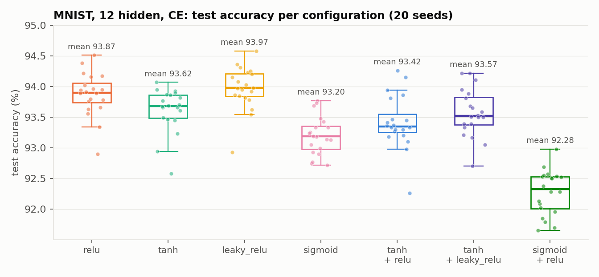
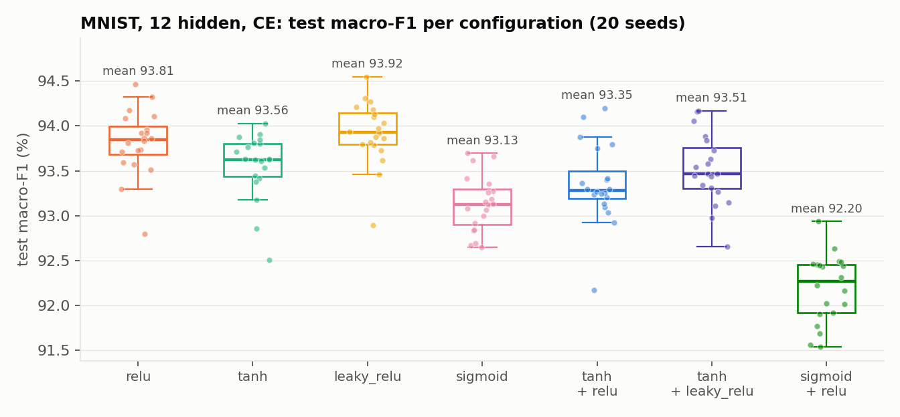
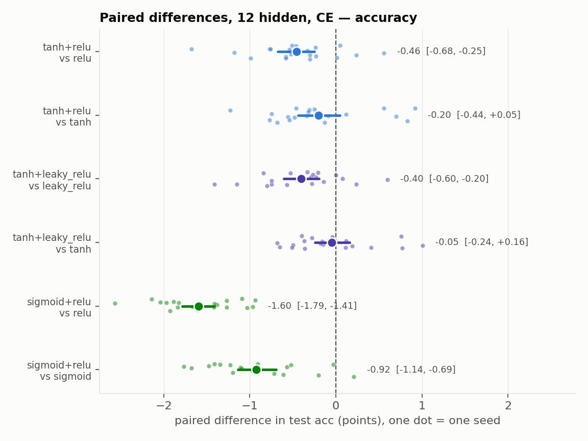
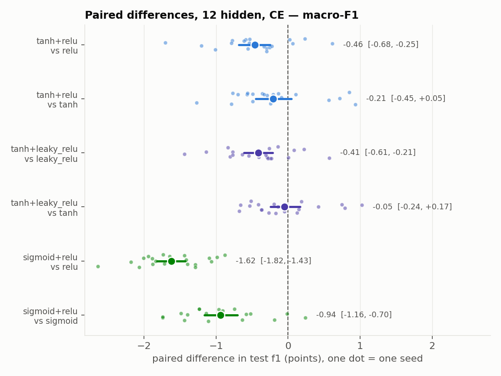
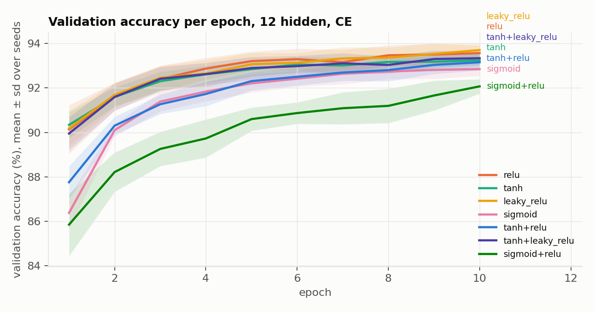

## 2. Learning-rate sensitivity (calibration sweeps, validation accuracy, mean of 3 seeds)

**12 hidden, CE**

| config | lr=0.001 | lr=0.003 | lr=0.01 | lr=0.03 | lr=0.1 |
|---|---|---|---|---|---|
| relu | 93.28 | 93.51 | 93.29 | 88.72 | 17.78 |
| tanh | 93.23 | 93.33 | 92.41 | 90.79 | 77.79 |
| leaky_relu | 93.07 | 93.48 | 93.41 | 92.80 | 82.75 |
| sigmoid | 88.01 | 91.78 | 92.55 | 91.73 | 90.85 |
| tanh+relu | 93.14 | 92.93 | 92.01 | 89.69 | 79.31 |
| tanh+leaky_relu | 93.14 | 93.16 | 92.64 | 91.75 | 79.72 |
| sigmoid+relu | 90.51 | 92.36 | 92.09 | 91.47 | 88.31 |

**12 hidden, MSE + sigmoid output**

| config | lr=0.003 | lr=0.01 | lr=0.03 |
|---|---|---|---|
| relu | 92.61 | 92.21 | 75.96 |
| tanh | 91.64 | 92.05 | 90.89 |
| tanh+relu | 92.50 | 92.73 | 92.57 |

**128 hidden, CE**

| config | lr=0.003 | lr=0.01 |
|---|---|---|
| relu | 97.64 | 97.62 |
| tanh | 97.18 | 98.02 |
| leaky_relu | 97.56 | 96.94 |
| tanh+relu | 97.66 | 97.98 |
| tanh+leaky_relu | 97.36 | 97.64 |

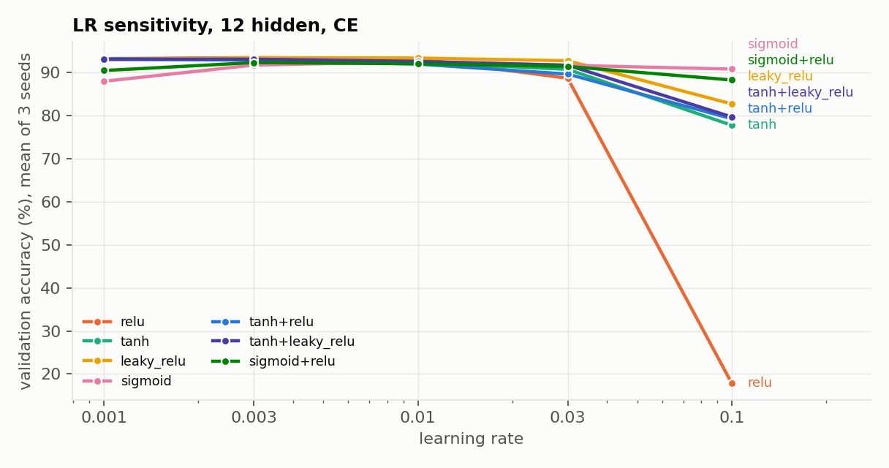
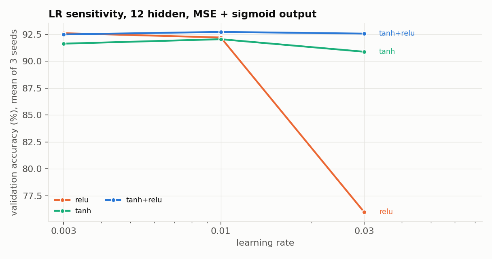

## 3. Does the layout or ratio matter? (tanh+relu, 12 hidden, CE, 20 seeds, lr fixed to the tanh+relu calibration)

| variant | lr | n | test acc mean ± sd | test macro-F1 mean ± sd | Δ acc vs relu (paired) | Δ acc vs tanh (paired) |
|---|---|---|---|---|---|---|
| block ratio=0.5 | 0.001 | 20 | 93.58 ± 0.36 | 93.51 ± 0.36 | -0.29 [-0.50, -0.10] | -0.04 [-0.19, +0.12] |
| random ratio=0.5 | 0.001 | 20 | 93.47 ± 0.33 | 93.40 ± 0.33 | -0.40 [-0.52, -0.28] | -0.14 [-0.33, +0.04] |
| interleave ratio=0.25 | 0.001 | 20 | 93.45 ± 0.27 | 93.39 ± 0.27 | -0.42 [-0.62, -0.21] | -0.16 [-0.32, +0.01] |
| interleave ratio=0.75 | 0.001 | 20 | 93.59 ± 0.47 | 93.53 ± 0.47 | -0.28 [-0.42, -0.14] | -0.02 [-0.29, +0.24] |
| interleave ratio=0.5 (main sweep) | 0.001 | 20 | 93.42 ± 0.44 | 93.35 ± 0.44 | -0.46 [-0.67, -0.24] | -0.20 [-0.44, +0.05] |

Note: the layout variants reuse the lr calibrated for interleave/0.5, so ratio 0.25/0.75 were not separately tuned.

## 4. Replication under the original loss (MSE, uniform sigmoid output, 12 hidden, 20 seeds)

| config | lr | n | test acc mean ± sd | median | test macro-F1 mean ± sd | val acc mean |
|---|---|---|---|---|---|---|
| relu | 0.003 | 20 | 93.13 ± 0.38 | 93.23 | 93.06 ± 0.38 | 92.77 |
| tanh | 0.01 | 20 | 92.49 ± 0.50 | 92.62 | 92.41 ± 0.51 | 92.08 |
| tanh+relu | 0.01 | 20 | 92.66 ± 0.51 | 92.64 | 92.59 ± 0.51 | 92.36 |

| comparison | metric | n | mean Δ (hybrid − parent) | 95% bootstrap CI | hybrid wins | paired t p | Wilcoxon p |
|---|---|---|---|---|---|---|---|
| tanh+relu vs relu | accuracy | 20 | -0.47 | [-0.72, -0.20] | 3/20 | 0.003 | 0.005 |
| tanh+relu vs relu | macro-F1 | 20 | -0.46 | [-0.72, -0.19] | 3/20 | 0.003 | 0.004 |
| tanh+relu vs tanh | accuracy | 20 | +0.17 | [-0.13, +0.48] | 13/20 | 0.299 | 0.334 |
| tanh+relu vs tanh | macro-F1 | 20 | +0.18 | [-0.14, +0.49] | 14/20 | 0.283 | 0.294 |

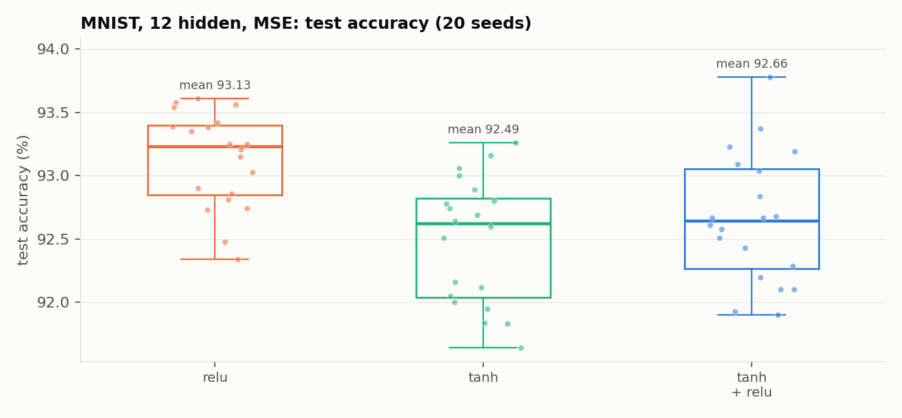

## 5. MNIST, 128 hidden neurons, cross-entropy (6 seeds per config)

| config | lr | n | test acc mean ± sd | median | test macro-F1 mean ± sd | val acc mean |
|---|---|---|---|---|---|---|
| relu | 0.003 | 6 | 97.38 ± 0.20 | 97.45 | 97.36 ± 0.20 | 97.45 |
| tanh | 0.01 | 6 | 97.56 ± 0.10 | 97.56 | 97.54 ± 0.10 | 97.63 |
| leaky_relu | 0.003 | 6 | 97.36 ± 0.13 | 97.38 | 97.33 ± 0.13 | 97.45 |
| tanh+relu | 0.01 | 6 | 97.56 ± 0.20 | 97.60 | 97.54 ± 0.20 | 97.63 |
| tanh+leaky_relu | 0.01 | 6 | 97.66 ± 0.08 | 97.66 | 97.64 ± 0.08 | 97.74 |

| comparison | metric | n | mean Δ (hybrid − parent) | 95% bootstrap CI | hybrid wins | paired t p | Wilcoxon p |
|---|---|---|---|---|---|---|---|
| tanh+relu vs relu | accuracy | 6 | +0.18 | [-0.04, +0.38] | 5/6 | 0.164 | 0.312 |
| tanh+relu vs relu | macro-F1 | 6 | +0.18 | [-0.03, +0.38] | 5/6 | 0.150 | 0.312 |
| tanh+relu vs tanh | accuracy | 6 | +0.00 | [-0.18, +0.15] | 3/6 | 1.000 | 1.000 |
| tanh+relu vs tanh | macro-F1 | 6 | +0.00 | [-0.17, +0.15] | 3/6 | 0.960 | 1.000 |
| tanh+leaky_relu vs leaky_relu | accuracy | 6 | +0.30 | [+0.19, +0.43] | 6/6 | 0.007 | 0.031 |
| tanh+leaky_relu vs leaky_relu | macro-F1 | 6 | +0.31 | [+0.18, +0.43] | 6/6 | 0.008 | 0.031 |
| tanh+leaky_relu vs tanh | accuracy | 6 | +0.10 | [-0.01, +0.20] | 4/6 | 0.159 | 0.219 |
| tanh+leaky_relu vs tanh | macro-F1 | 6 | +0.10 | [-0.01, +0.21] | 4/6 | 0.160 | 0.219 |

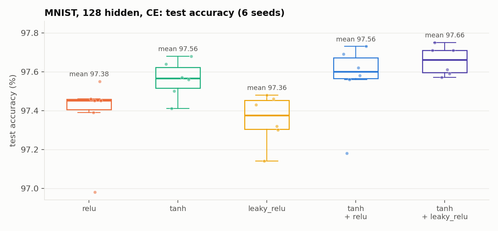
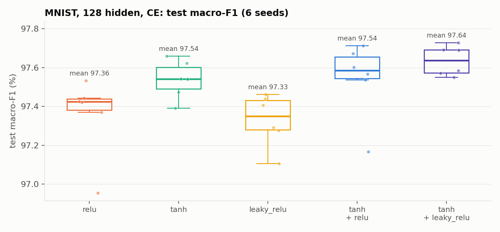
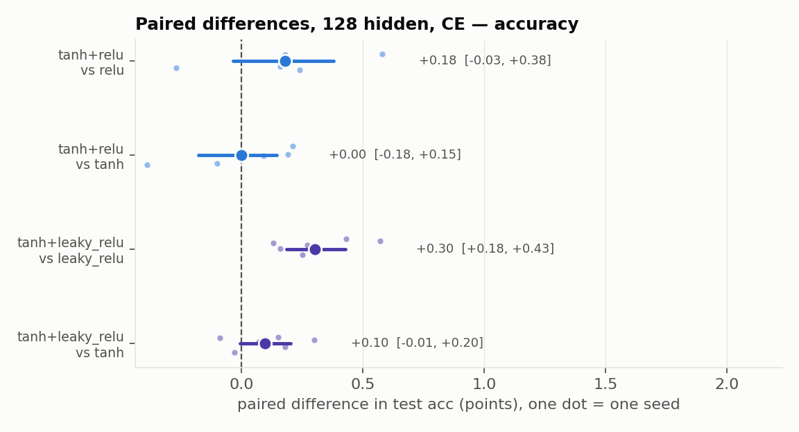
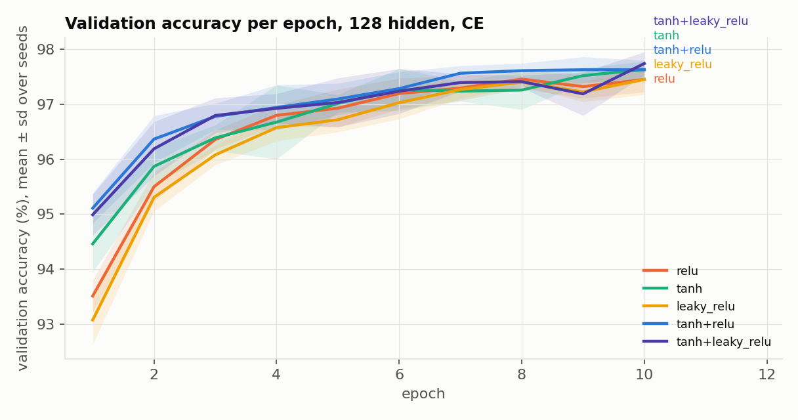

## Run inventory

| file | ok runs |
|---|---|
| main_12.csv | 140 |
| layout_12.csv | 80 |
| mse_12.csv | 60 |
| main_128.csv | 30 |
| calib_12.csv | 105 |
| calib_mse.csv | 27 |
| calib_128.csv | 10 |
