# version5 results (extended sweep): hybrid activations across width, learning rate and layout

Protocol: MLP 784→H→H→10, batch-size-1 SGD, 10 epochs, fixed 45k/5k/10k train/val/test split shared by all runs, per-epoch shuffling, He/Kaiming-uniform init. Hidden layers carry per-neuron activation masks; the output layer is uniform (linear+softmax with cross-entropy, or sigmoid with MSE). Learning rate chosen per configuration on validation accuracy using calibration seeds (101–103) that are disjoint from the evaluation seeds (1–N). All comparisons are paired by seed. Bootstrap CIs use 10,000 resamples and a collapsed run means final validation accuracy below 50%.

## 0. Files used

| stage | width | file | superseded |
|---|---|---|---|
| main | 12 | `main_12_v2.csv` | `main_12.csv` |
| main | 32 | `main_32.csv` | — |
| main | 64 | `main_64.csv` | — |
| main | 128 | `main_128_v2.csv` | `main_128.csv` |
| main | 256 | `main_256.csv` | — |
| main | 512 | `main_512.csv` | — |
| calib | 12 | `calib_12_v2.csv` | `calib_12.csv` |
| calib | 32 | `calib_32.csv` | — |
| calib | 64 | `calib_64.csv` | — |
| calib | 128 | `calib_128_v2.csv` | `calib_128.csv` |
| calib | 256 | `calib_256.csv` | — |
| calib | 512 | `calib_512.csv` | — |
| lrsweep | 12 | `lrsweep_12.csv` | — |
| lrsweep | 64 | `lrsweep_64.csv` | — |
| lrsweep | 128 | `lrsweep_128.csv` | — |
| layout | 12 | `layout_12.csv` | — |
| layout | 128 | `layout_128.csv` | — |
| layout | 256 | `layout_256.csv` | — |

Where both `main_<W>.csv` and `main_<W>_v2.csv` exist the `_v2` file is used and the older one ignored: W=12 uses `main_12_v2.csv`, ignores `main_12.csv`, W=128 uses `main_128_v2.csv`, ignores `main_128.csv`.

## 1. Run inventory (evaluation runs, config × width → n)

| config | W=12 | W=32 | W=64 | W=128 | W=256 | W=512 |
|---|---|---|---|---|---|---|
| relu | 30 | 30 | 20 | 20 | 10 | 5 |
| tanh | 30 | 30 | 20 | 20 | 10 | 5 |
| leaky_relu | 30 | 30 | 20 | 20 | 10 | 5 |
| sigmoid | 30 | 30 | 20 | 20 | – | – |
| tanh+relu | 30 | 30 | 20 | 20 | 10 | 5 |
| tanh+leaky_relu | 30 | 30 | 20 | 20 | 10 | 5 |
| sigmoid+relu | 30 | 30 | 20 | 20 | – | – |

| other stage | file | ok runs |
|---|---|---|
| calib | `calib_12_v2.csv` | 84 |
| calib | `calib_32.csv` | 84 |
| calib | `calib_64.csv` | 84 |
| calib | `calib_128_v2.csv` | 84 |
| calib | `calib_256.csv` | 60 |
| calib | `calib_512.csv` | 34 |
| lrsweep | `lrsweep_12.csv` | 300 |
| lrsweep | `lrsweep_64.csv` | 250 |
| lrsweep | `lrsweep_128.csv` | 250 |
| layout | `layout_12.csv` | 80 |
| layout | `layout_128.csv` | 100 |
| layout | `layout_256.csv` | 60 |
| mse | `mse_12.csv` | 60 |
| calib | `calib_mse.csv` | 27 |
| mse | `mse_128.csv` | 30 |
| calib | `calib_mse_128.csv` | 27 |

## 2.12 MNIST, 12 hidden neurons, cross-entropy (30 seeds per config)

| config | lr | n | test acc mean ± sd | median | test macro-F1 mean ± sd | val acc mean |
|---|---|---|---|---|---|---|
| relu | 0.003 | 30 | 93.72 ± 0.49 | 93.85 | 93.63 ± 0.50 | 93.94 |
| tanh | 0.003 | 30 | 93.32 ± 0.27 | 93.31 | 93.22 ± 0.26 | 93.67 |
| leaky_relu | 0.003 | 30 | 93.74 ± 0.45 | 93.82 | 93.64 ± 0.46 | 93.91 |
| sigmoid | 0.01 | 30 | 93.09 ± 0.36 | 93.12 | 92.97 ± 0.36 | 93.42 |
| tanh+relu | 0.003 | 30 | 93.15 ± 0.47 | 93.19 | 93.03 ± 0.48 | 93.42 |
| tanh+leaky_relu | 0.003 | 30 | 93.38 ± 0.37 | 93.43 | 93.27 ± 0.38 | 93.65 |
| sigmoid+relu | 0.01 | 30 | 92.56 ± 0.56 | 92.63 | 92.44 ± 0.56 | 92.85 |

Paired comparisons (hybrid minus each homogeneous parent, same seeds):

| comparison | metric | n | mean Δ (hybrid − parent) | 95% bootstrap CI | hybrid wins | paired t p | Wilcoxon p |
|---|---|---|---|---|---|---|---|
| tanh+relu vs relu | accuracy | 30 | -0.57 | [-0.77, -0.38] | 4/30 | 5.5e-06 | 6.0e-05 |
| tanh+relu vs relu | macro-F1 | 30 | -0.60 | [-0.81, -0.40] | 4/30 | 4.0e-06 | 9.2e-06 |
| tanh+relu vs tanh | accuracy | 30 | -0.17 | [-0.36, +0.01] | 10/30 | 0.084 | 0.058 |
| tanh+relu vs tanh | macro-F1 | 30 | -0.18 | [-0.37, +0.01] | 11/30 | 0.076 | 0.052 |
| tanh+leaky_relu vs leaky_relu | accuracy | 30 | -0.36 | [-0.54, -0.18] | 8/30 | 6.2e-04 | 0.001 |
| tanh+leaky_relu vs leaky_relu | macro-F1 | 30 | -0.37 | [-0.56, -0.18] | 8/30 | 6.2e-04 | 6.1e-04 |
| tanh+leaky_relu vs tanh | accuracy | 30 | +0.06 | [-0.13, +0.24] | 19/30 | 0.536 | 0.382 |
| tanh+leaky_relu vs tanh | macro-F1 | 30 | +0.06 | [-0.13, +0.24] | 20/30 | 0.564 | 0.382 |
| sigmoid+relu vs relu | accuracy | 30 | -1.16 | [-1.42, -0.89] | 1/30 | 1.9e-09 | 1.2e-05 |
| sigmoid+relu vs relu | macro-F1 | 30 | -1.19 | [-1.45, -0.92] | 1/30 | 1.4e-09 | 6.9e-07 |
| sigmoid+relu vs sigmoid | accuracy | 30 | -0.53 | [-0.77, -0.29] | 4/30 | 2.2e-04 | 4.2e-04 |
| sigmoid+relu vs sigmoid | macro-F1 | 30 | -0.53 | [-0.77, -0.29] | 4/30 | 2.1e-04 | 1.7e-04 |

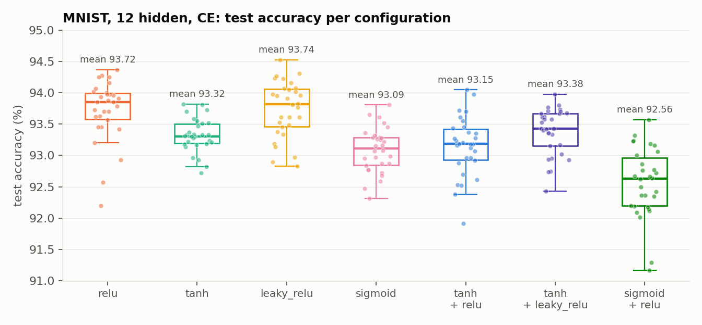

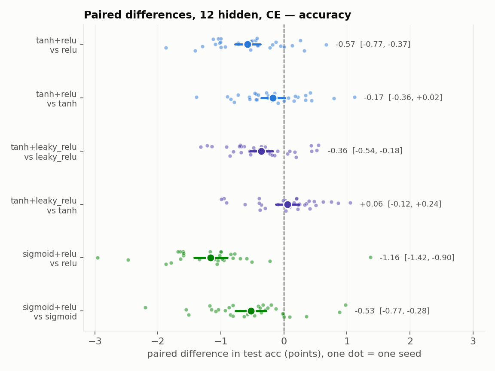

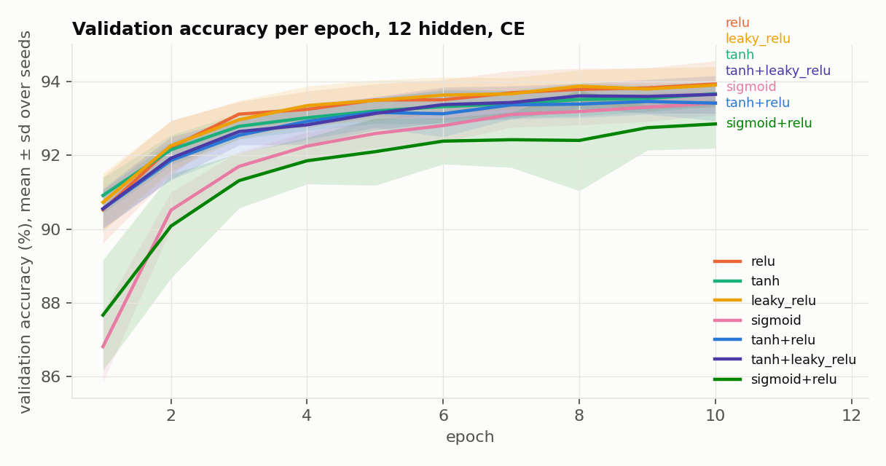

## 2.32 MNIST, 32 hidden neurons, cross-entropy (30 seeds per config)

| config | lr | n | test acc mean ± sd | median | test macro-F1 mean ± sd | val acc mean |
|---|---|---|---|---|---|---|
| relu | 0.003 | 30 | 96.45 ± 0.26 | 96.49 | 96.40 ± 0.26 | 96.42 |
| tanh | 0.003 | 30 | 96.19 ± 0.25 | 96.20 | 96.14 ± 0.24 | 96.28 |
| leaky_relu | 0.003 | 30 | 96.37 ± 0.32 | 96.37 | 96.32 ± 0.32 | 96.33 |
| sigmoid | 0.01 | 30 | 95.89 ± 0.24 | 95.93 | 95.84 ± 0.24 | 96.18 |
| tanh+relu | 0.003 | 30 | 96.27 ± 0.20 | 96.32 | 96.22 ± 0.20 | 96.33 |
| tanh+leaky_relu | 0.003 | 30 | 96.26 ± 0.26 | 96.33 | 96.21 ± 0.26 | 96.35 |
| sigmoid+relu | 0.01 | 30 | 95.01 ± 0.59 | 95.14 | 94.95 ± 0.59 | 95.21 |

Paired comparisons (hybrid minus each homogeneous parent, same seeds):

| comparison | metric | n | mean Δ (hybrid − parent) | 95% bootstrap CI | hybrid wins | paired t p | Wilcoxon p |
|---|---|---|---|---|---|---|---|
| tanh+relu vs relu | accuracy | 30 | -0.18 | [-0.27, -0.09] | 7/30 | 5.6e-04 | 9.6e-04 |
| tanh+relu vs relu | macro-F1 | 30 | -0.18 | [-0.27, -0.10] | 6/30 | 4.2e-04 | 3.8e-04 |
| tanh+relu vs tanh | accuracy | 30 | +0.08 | [-0.01, +0.16] | 18/30 | 0.084 | 0.106 |
| tanh+relu vs tanh | macro-F1 | 30 | +0.08 | [-0.01, +0.16] | 18/30 | 0.083 | 0.096 |
| tanh+leaky_relu vs leaky_relu | accuracy | 30 | -0.10 | [-0.24, +0.05] | 9/30 | 0.170 | 0.044 |
| tanh+leaky_relu vs leaky_relu | macro-F1 | 30 | -0.10 | [-0.24, +0.05] | 9/30 | 0.170 | 0.038 |
| tanh+leaky_relu vs tanh | accuracy | 30 | +0.07 | [-0.01, +0.15] | 20/30 | 0.090 | 0.094 |
| tanh+leaky_relu vs tanh | macro-F1 | 30 | +0.08 | [-0.01, +0.15] | 20/30 | 0.082 | 0.084 |
| sigmoid+relu vs relu | accuracy | 30 | -1.44 | [-1.68, -1.22] | 0/30 | 1.1e-12 | 1.9e-09 |
| sigmoid+relu vs relu | macro-F1 | 30 | -1.45 | [-1.70, -1.23] | 0/30 | 9.5e-13 | 1.9e-09 |
| sigmoid+relu vs sigmoid | accuracy | 30 | -0.88 | [-1.11, -0.67] | 1/30 | 1.3e-08 | 2.4e-06 |
| sigmoid+relu vs sigmoid | macro-F1 | 30 | -0.89 | [-1.11, -0.68] | 1/30 | 1.2e-08 | 5.6e-09 |

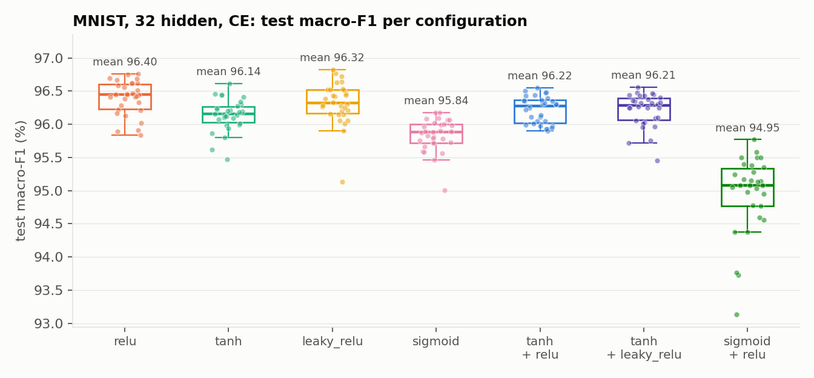
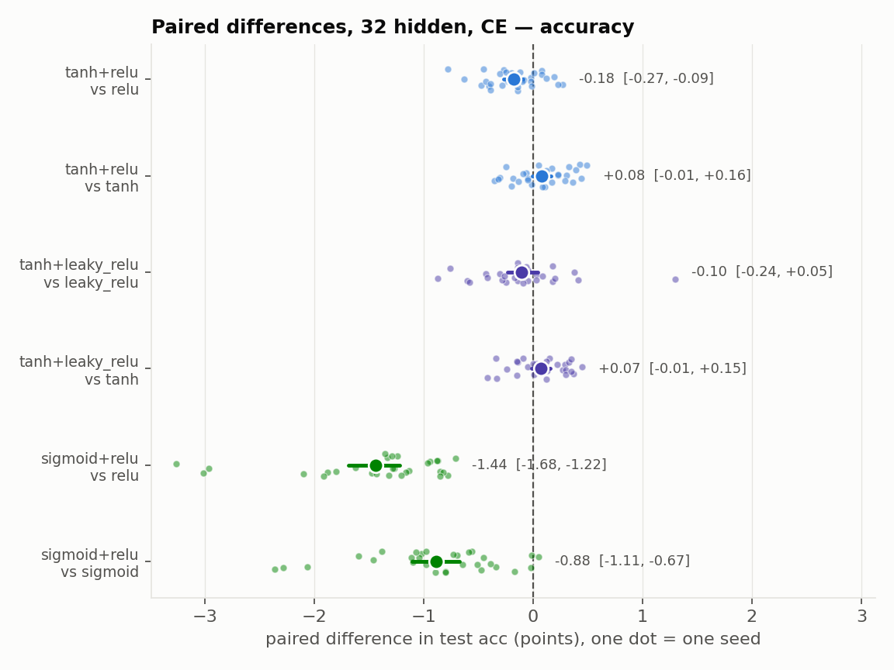
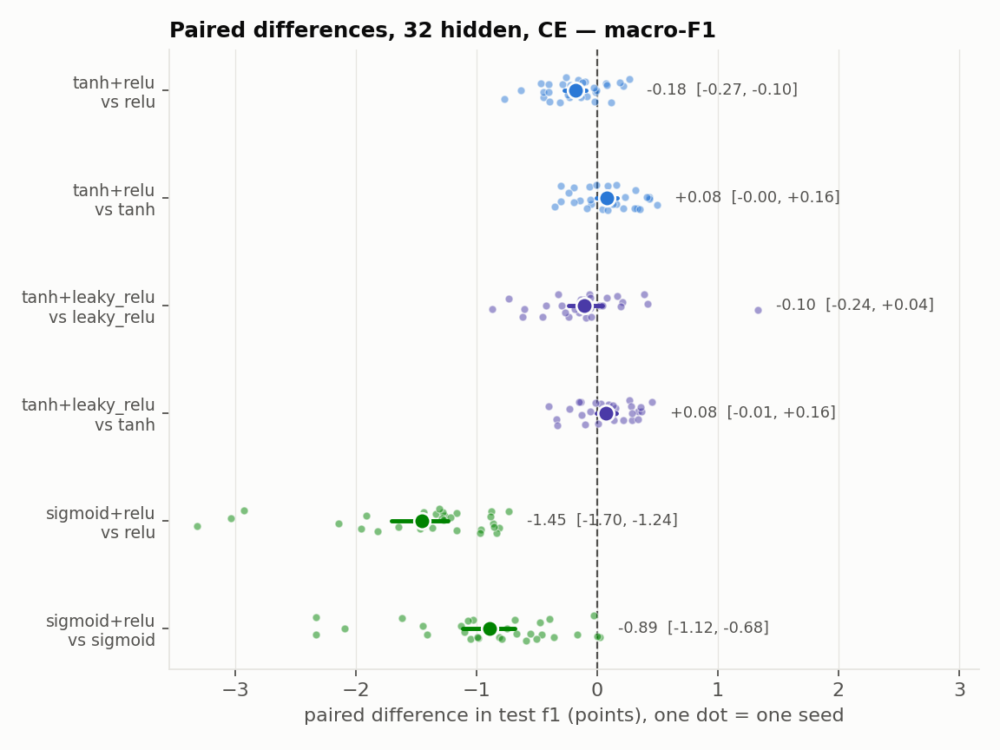
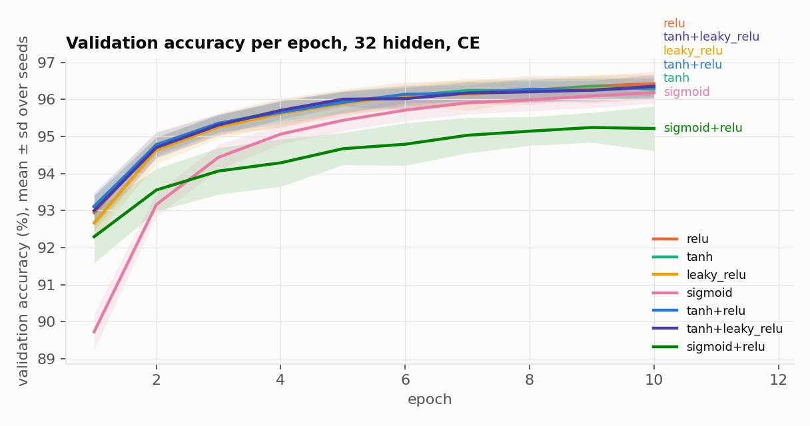

## 2.64 MNIST, 64 hidden neurons, cross-entropy (20 seeds per config)

| config | lr | n | test acc mean ± sd | median | test macro-F1 mean ± sd | val acc mean |
|---|---|---|---|---|---|---|
| relu | 0.003 | 20 | 97.19 ± 0.20 | 97.23 | 97.16 ± 0.20 | 97.16 |
| tanh | 0.003 | 20 | 97.11 ± 0.12 | 97.12 | 97.07 ± 0.12 | 97.08 |
| leaky_relu | 0.003 | 20 | 97.17 ± 0.23 | 97.18 | 97.14 ± 0.23 | 97.13 |
| sigmoid | 0.03 | 20 | 96.96 ± 0.16 | 96.96 | 96.92 ± 0.16 | 97.00 |
| tanh+relu | 0.01 | 20 | 97.22 ± 0.23 | 97.27 | 97.19 ± 0.23 | 97.11 |
| tanh+leaky_relu | 0.01 | 20 | 97.16 ± 0.22 | 97.14 | 97.13 ± 0.22 | 97.12 |
| sigmoid+relu | 0.003 | 20 | 96.50 ± 0.25 | 96.48 | 96.45 ± 0.25 | 96.53 |

Paired comparisons (hybrid minus each homogeneous parent, same seeds):

| comparison | metric | n | mean Δ (hybrid − parent) | 95% bootstrap CI | hybrid wins | paired t p | Wilcoxon p |
|---|---|---|---|---|---|---|---|
| tanh+relu vs relu | accuracy | 20 | +0.03 | [-0.07, +0.13] | 11/20 | 0.640 | 0.765 |
| tanh+relu vs relu | macro-F1 | 20 | +0.02 | [-0.08, +0.13] | 11/20 | 0.672 | 0.784 |
| tanh+relu vs tanh | accuracy | 20 | +0.11 | [+0.00, +0.21] | 13/20 | 0.057 | 0.049 |
| tanh+relu vs tanh | macro-F1 | 20 | +0.11 | [+0.00, +0.22] | 14/20 | 0.058 | 0.053 |
| tanh+leaky_relu vs leaky_relu | accuracy | 20 | -0.01 | [-0.13, +0.11] | 10/20 | 0.927 | 0.968 |
| tanh+leaky_relu vs leaky_relu | macro-F1 | 20 | -0.01 | [-0.14, +0.12] | 11/20 | 0.912 | 0.985 |
| tanh+leaky_relu vs tanh | accuracy | 20 | +0.05 | [-0.05, +0.15] | 15/20 | 0.305 | 0.218 |
| tanh+leaky_relu vs tanh | macro-F1 | 20 | +0.06 | [-0.05, +0.15] | 15/20 | 0.296 | 0.231 |
| sigmoid+relu vs relu | accuracy | 20 | -0.70 | [-0.85, -0.54] | 0/20 | 5.4e-08 | 1.3e-04 |
| sigmoid+relu vs relu | macro-F1 | 20 | -0.71 | [-0.86, -0.55] | 0/20 | 4.5e-08 | 1.9e-06 |
| sigmoid+relu vs sigmoid | accuracy | 20 | -0.46 | [-0.59, -0.32] | 1/20 | 2.3e-06 | 1.6e-04 |
| sigmoid+relu vs sigmoid | macro-F1 | 20 | -0.46 | [-0.59, -0.33] | 1/20 | 2.2e-06 | 1.3e-05 |

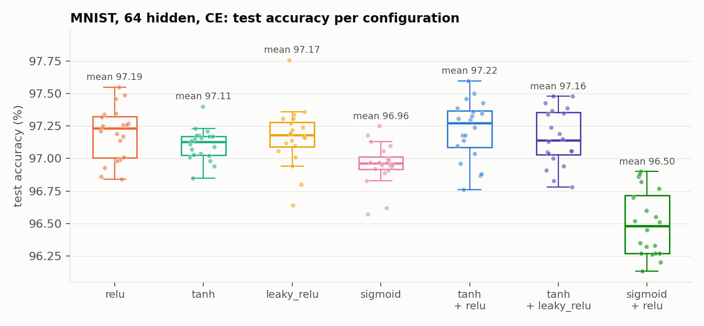
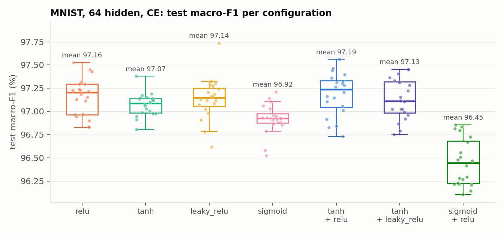
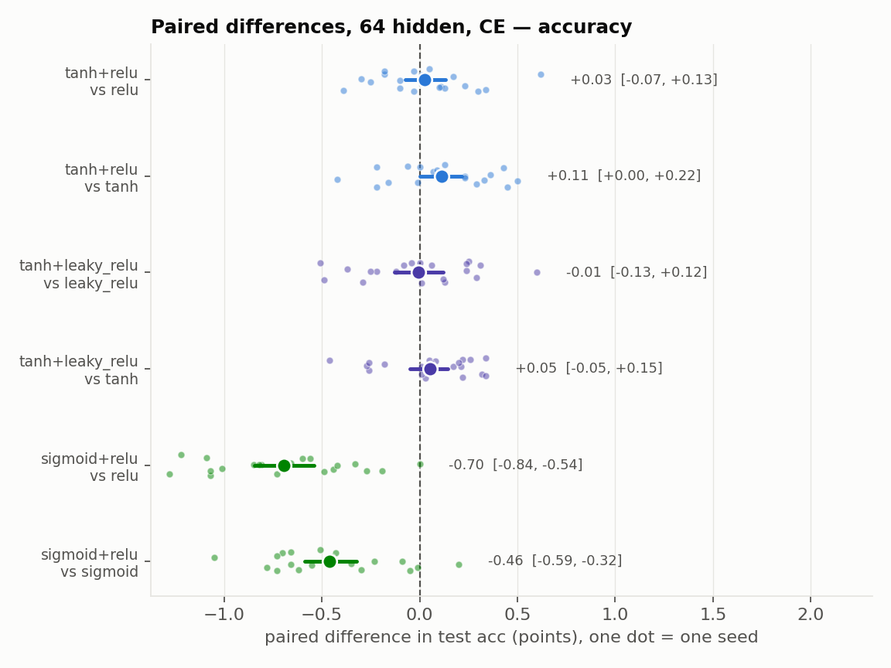
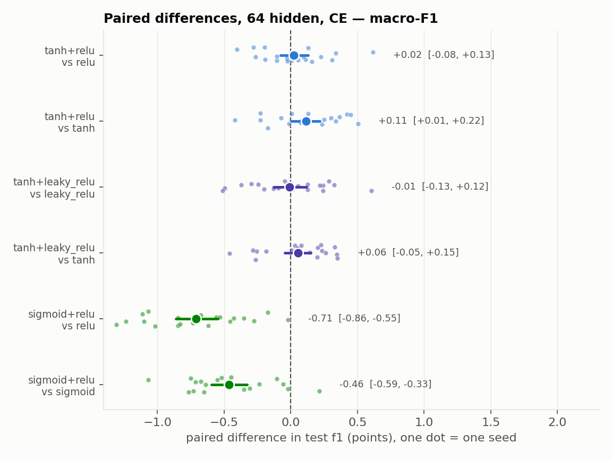
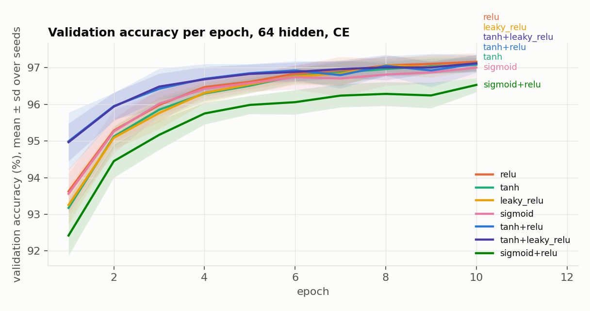

## 2.128 MNIST, 128 hidden neurons, cross-entropy (20 seeds per config)

| config | lr | n | test acc mean ± sd | median | test macro-F1 mean ± sd | val acc mean |
|---|---|---|---|---|---|---|
| relu | 0.003 | 20 | 97.75 ± 0.14 | 97.75 | 97.72 ± 0.14 | 97.61 |
| tanh | 0.01 | 20 | 97.70 ± 0.15 | 97.68 | 97.67 ± 0.15 | 97.60 |
| leaky_relu | 0.003 | 20 | 97.60 ± 0.13 | 97.63 | 97.58 ± 0.13 | 97.53 |
| sigmoid | 0.03 | 20 | 97.43 ± 0.32 | 97.48 | 97.40 ± 0.31 | 97.40 |
| tanh+relu | 0.01 | 20 | 97.83 ± 0.18 | 97.85 | 97.80 ± 0.19 | 97.66 |
| tanh+leaky_relu | 0.01 | 20 | 97.71 ± 0.36 | 97.79 | 97.69 ± 0.36 | 97.53 |
| sigmoid+relu | 0.003 | 20 | 97.20 ± 0.18 | 97.19 | 97.17 ± 0.18 | 97.12 |

Paired comparisons (hybrid minus each homogeneous parent, same seeds):

| comparison | metric | n | mean Δ (hybrid − parent) | 95% bootstrap CI | hybrid wins | paired t p | Wilcoxon p |
|---|---|---|---|---|---|---|---|
| tanh+relu vs relu | accuracy | 20 | +0.08 | [-0.02, +0.18] | 14/20 | 0.159 | 0.156 |
| tanh+relu vs relu | macro-F1 | 20 | +0.08 | [-0.02, +0.19] | 14/20 | 0.150 | 0.167 |
| tanh+relu vs tanh | accuracy | 20 | +0.13 | [+0.03, +0.22] | 16/20 | 0.020 | 0.035 |
| tanh+relu vs tanh | macro-F1 | 20 | +0.13 | [+0.03, +0.22] | 16/20 | 0.018 | 0.033 |
| tanh+leaky_relu vs leaky_relu | accuracy | 20 | +0.11 | [-0.05, +0.23] | 16/20 | 0.152 | 0.012 |
| tanh+leaky_relu vs leaky_relu | macro-F1 | 20 | +0.11 | [-0.04, +0.23] | 16/20 | 0.145 | 0.011 |
| tanh+leaky_relu vs tanh | accuracy | 20 | +0.02 | [-0.14, +0.14] | 12/20 | 0.796 | 0.313 |
| tanh+leaky_relu vs tanh | macro-F1 | 20 | +0.02 | [-0.13, +0.14] | 12/20 | 0.788 | 0.294 |
| sigmoid+relu vs relu | accuracy | 20 | -0.54 | [-0.63, -0.45] | 0/20 | 1.1e-09 | 8.8e-05 |
| sigmoid+relu vs relu | macro-F1 | 20 | -0.55 | [-0.64, -0.46] | 0/20 | 8.0e-10 | 1.9e-06 |
| sigmoid+relu vs sigmoid | accuracy | 20 | -0.23 | [-0.33, -0.08] | 2/20 | 0.003 | 0.002 |
| sigmoid+relu vs sigmoid | macro-F1 | 20 | -0.23 | [-0.34, -0.08] | 2/20 | 0.002 | 8.5e-04 |

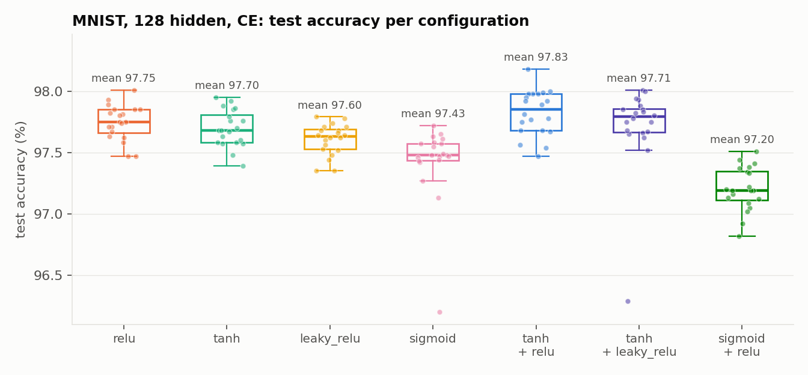
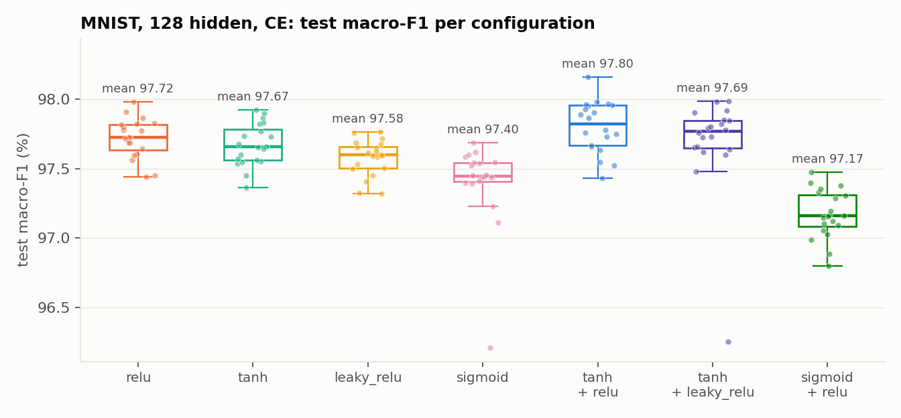

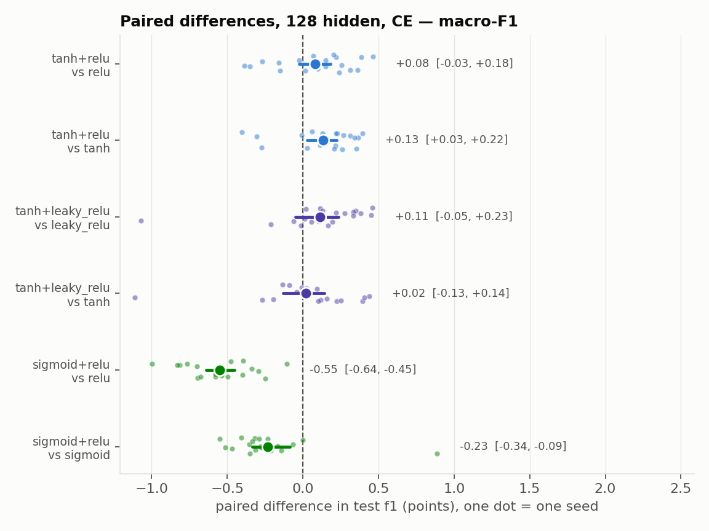
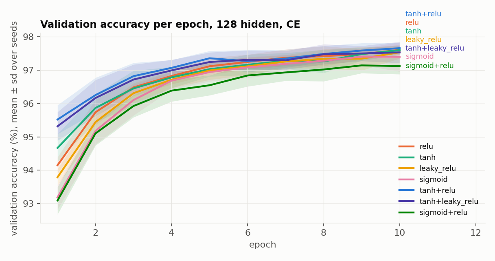

## 2.256 MNIST, 256 hidden neurons, cross-entropy (10 seeds per config)

| config | lr | n | test acc mean ± sd | median | test macro-F1 mean ± sd | val acc mean |
|---|---|---|---|---|---|---|
| relu | 0.003 | 10 | 97.92 ± 0.31 | 98.03 | 97.89 ± 0.31 | 97.76 |
| tanh | 0.01 | 10 | 97.84 ± 0.14 | 97.84 | 97.81 ± 0.15 | 97.73 |
| leaky_relu | 0.01 | 10 | 97.89 ± 0.21 | 97.94 | 97.86 ± 0.21 | 97.75 |
| tanh+relu | 0.01 | 10 | 98.14 ± 0.16 | 98.16 | 98.12 ± 0.16 | 97.85 |
| tanh+leaky_relu | 0.01 | 10 | 97.95 ± 0.25 | 97.97 | 97.92 ± 0.26 | 97.77 |

Paired comparisons (hybrid minus each homogeneous parent, same seeds):

| comparison | metric | n | mean Δ (hybrid − parent) | 95% bootstrap CI | hybrid wins | paired t p | Wilcoxon p |
|---|---|---|---|---|---|---|---|
| tanh+relu vs relu | accuracy | 10 | +0.23 | [+0.03, +0.44] | 8/10 | 0.071 | 0.084 |
| tanh+relu vs relu | macro-F1 | 10 | +0.23 | [+0.03, +0.44] | 8/10 | 0.072 | 0.084 |
| tanh+relu vs tanh | accuracy | 10 | +0.30 | [+0.15, +0.45] | 8/10 | 0.004 | 0.010 |
| tanh+relu vs tanh | macro-F1 | 10 | +0.31 | [+0.15, +0.45] | 8/10 | 0.005 | 0.010 |
| tanh+leaky_relu vs leaky_relu | accuracy | 10 | +0.06 | [-0.12, +0.24] | 5/10 | 0.534 | 0.625 |
| tanh+leaky_relu vs leaky_relu | macro-F1 | 10 | +0.06 | [-0.12, +0.25] | 5/10 | 0.535 | 0.625 |
| tanh+leaky_relu vs tanh | accuracy | 10 | +0.11 | [-0.08, +0.28] | 6/10 | 0.288 | 0.336 |
| tanh+leaky_relu vs tanh | macro-F1 | 10 | +0.11 | [-0.08, +0.29] | 6/10 | 0.292 | 0.322 |

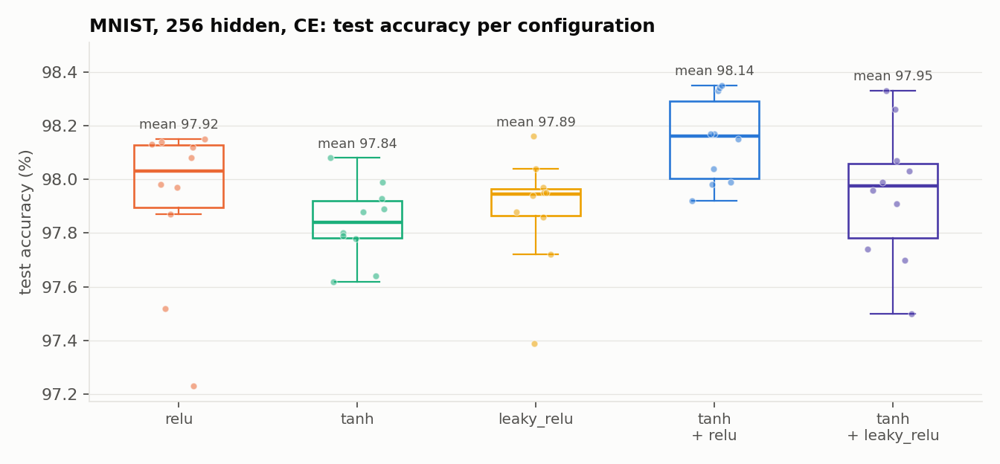
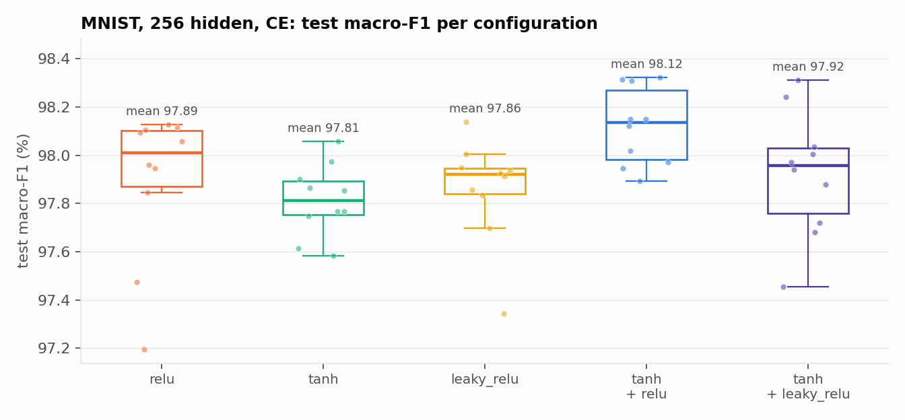
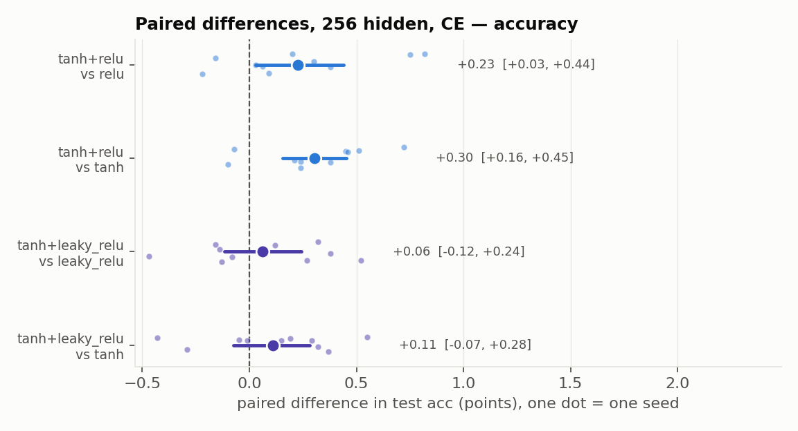
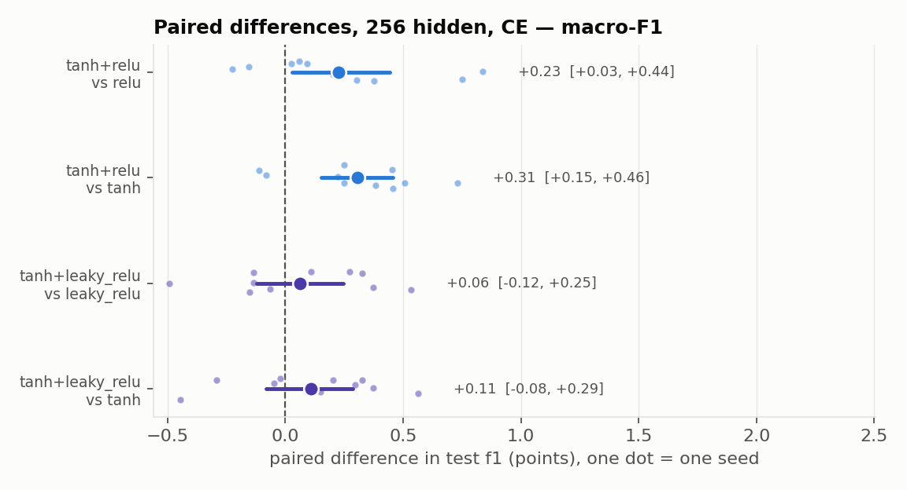
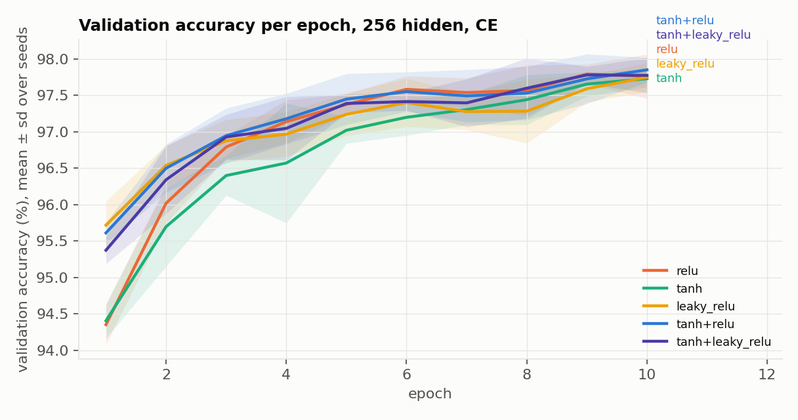

## 2.512 MNIST, 512 hidden neurons, cross-entropy (5 seeds per config)

| config | lr | n | test acc mean ± sd | median | test macro-F1 mean ± sd | val acc mean |
|---|---|---|---|---|---|---|
| relu | 0.01 | 5 | 98.02 ± 0.21 | 98.13 | 98.00 ± 0.21 | 97.85 |
| tanh | 0.01 | 5 | 97.74 ± 0.11 | 97.76 | 97.71 ± 0.12 | 97.63 |
| leaky_relu | 0.003 | 5 | 98.00 ± 0.11 | 98.02 | 97.97 ± 0.11 | 97.82 |
| tanh+relu | 0.01 | 5 | 98.14 ± 0.14 | 98.14 | 98.11 ± 0.15 | 97.93 |
| tanh+leaky_relu | 0.003 | 5 | 97.79 ± 0.22 | 97.79 | 97.76 ± 0.22 | 97.64 |

Paired comparisons (hybrid minus each homogeneous parent, same seeds):

| comparison | metric | n | mean Δ (hybrid − parent) | 95% bootstrap CI | hybrid wins | paired t p | Wilcoxon p |
|---|---|---|---|---|---|---|---|
| tanh+relu vs relu | accuracy | 5 | +0.12 | [-0.14, +0.38] | 3/5 | 0.476 | 0.625 |
| tanh+relu vs relu | macro-F1 | 5 | +0.11 | [-0.15, +0.38] | 3/5 | 0.497 | 0.625 |
| tanh+relu vs tanh | accuracy | 5 | +0.40 | [+0.31, +0.53] | 5/5 | 0.003 | 0.062 |
| tanh+relu vs tanh | macro-F1 | 5 | +0.40 | [+0.31, +0.55] | 5/5 | 0.004 | 0.062 |
| tanh+leaky_relu vs leaky_relu | accuracy | 5 | -0.21 | [-0.31, -0.10] | 0/5 | 0.027 | 0.062 |
| tanh+leaky_relu vs leaky_relu | macro-F1 | 5 | -0.21 | [-0.31, -0.10] | 0/5 | 0.028 | 0.062 |
| tanh+leaky_relu vs tanh | accuracy | 5 | +0.05 | [-0.07, +0.14] | 4/5 | 0.510 | 0.625 |
| tanh+leaky_relu vs tanh | macro-F1 | 5 | +0.05 | [-0.06, +0.14] | 4/5 | 0.440 | 0.625 |

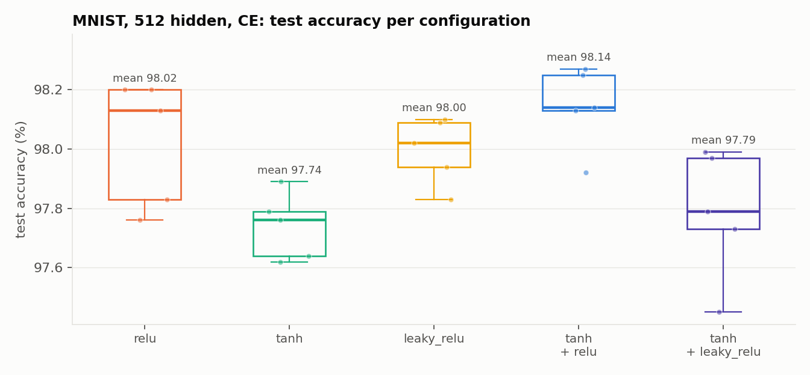
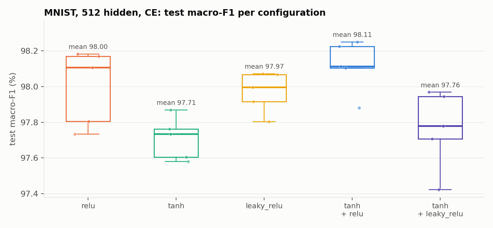
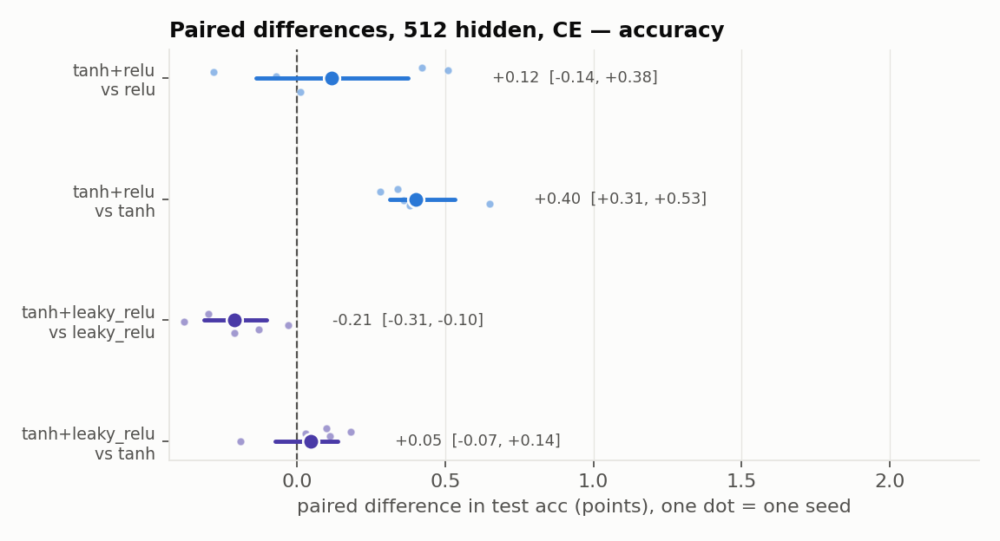

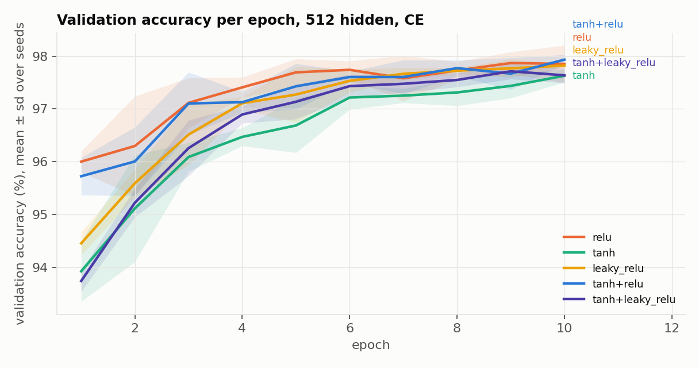

## 3. Crossover: paired hybrid − parent against width

One row per comparison and width. Δ is the paired mean difference in points (positive = the hybrid is ahead), CI is the 95% bootstrap interval.

**accuracy**

| comparison | width | n | Δ | 95% CI | wins | paired t p | Wilcoxon p |
|---|---|---|---|---|---|---|---|
| tanh+relu − relu | 12 | 30 | -0.57 | [-0.77, -0.37] | 4/30 | 5.5e-06 | 6.0e-05 |
| tanh+relu − relu | 32 | 30 | -0.18 | [-0.27, -0.09] | 7/30 | 5.6e-04 | 9.6e-04 |
| tanh+relu − relu | 64 | 20 | +0.03 | [-0.07, +0.13] | 11/20 | 0.640 | 0.765 |
| tanh+relu − relu | 128 | 20 | +0.08 | [-0.03, +0.18] | 14/20 | 0.159 | 0.156 |
| tanh+relu − relu | 256 | 10 | +0.23 | [+0.03, +0.44] | 8/10 | 0.071 | 0.084 |
| tanh+relu − relu | 512 | 5 | +0.12 | [-0.14, +0.38] | 3/5 | 0.476 | 0.625 |
| tanh+relu − tanh | 12 | 30 | -0.17 | [-0.36, +0.02] | 10/30 | 0.084 | 0.058 |
| tanh+relu − tanh | 32 | 30 | +0.08 | [-0.01, +0.16] | 18/30 | 0.084 | 0.106 |
| tanh+relu − tanh | 64 | 20 | +0.11 | [+0.00, +0.22] | 13/20 | 0.057 | 0.049 |
| tanh+relu − tanh | 128 | 20 | +0.13 | [+0.03, +0.22] | 16/20 | 0.020 | 0.035 |
| tanh+relu − tanh | 256 | 10 | +0.30 | [+0.15, +0.45] | 8/10 | 0.004 | 0.010 |
| tanh+relu − tanh | 512 | 5 | +0.40 | [+0.32, +0.53] | 5/5 | 0.003 | 0.062 |
| tanh+leaky_relu − leaky_relu | 12 | 30 | -0.36 | [-0.54, -0.18] | 8/30 | 6.2e-04 | 0.001 |
| tanh+leaky_relu − leaky_relu | 32 | 30 | -0.10 | [-0.24, +0.05] | 9/30 | 0.170 | 0.044 |
| tanh+leaky_relu − leaky_relu | 64 | 20 | -0.01 | [-0.13, +0.12] | 10/20 | 0.927 | 0.968 |
| tanh+leaky_relu − leaky_relu | 128 | 20 | +0.11 | [-0.05, +0.23] | 16/20 | 0.152 | 0.012 |
| tanh+leaky_relu − leaky_relu | 256 | 10 | +0.06 | [-0.12, +0.24] | 5/10 | 0.534 | 0.625 |
| tanh+leaky_relu − leaky_relu | 512 | 5 | -0.21 | [-0.31, -0.10] | 0/5 | 0.027 | 0.062 |
| tanh+leaky_relu − tanh | 12 | 30 | +0.06 | [-0.13, +0.24] | 19/30 | 0.536 | 0.382 |
| tanh+leaky_relu − tanh | 32 | 30 | +0.07 | [-0.01, +0.15] | 20/30 | 0.090 | 0.094 |
| tanh+leaky_relu − tanh | 64 | 20 | +0.05 | [-0.05, +0.15] | 15/20 | 0.305 | 0.218 |
| tanh+leaky_relu − tanh | 128 | 20 | +0.02 | [-0.13, +0.14] | 12/20 | 0.796 | 0.313 |
| tanh+leaky_relu − tanh | 256 | 10 | +0.11 | [-0.07, +0.28] | 6/10 | 0.288 | 0.336 |
| tanh+leaky_relu − tanh | 512 | 5 | +0.05 | [-0.07, +0.14] | 4/5 | 0.510 | 0.625 |

**macro-F1**

| comparison | width | n | Δ | 95% CI | wins | paired t p | Wilcoxon p |
|---|---|---|---|---|---|---|---|
| tanh+relu − relu | 12 | 30 | -0.60 | [-0.80, -0.39] | 4/30 | 4.0e-06 | 9.2e-06 |
| tanh+relu − relu | 32 | 30 | -0.18 | [-0.27, -0.09] | 6/30 | 4.2e-04 | 3.8e-04 |
| tanh+relu − relu | 64 | 20 | +0.02 | [-0.08, +0.13] | 11/20 | 0.672 | 0.784 |
| tanh+relu − relu | 128 | 20 | +0.08 | [-0.03, +0.18] | 14/20 | 0.150 | 0.167 |
| tanh+relu − relu | 256 | 10 | +0.23 | [+0.03, +0.44] | 8/10 | 0.072 | 0.084 |
| tanh+relu − relu | 512 | 5 | +0.11 | [-0.15, +0.38] | 3/5 | 0.497 | 0.625 |
| tanh+relu − tanh | 12 | 30 | -0.18 | [-0.37, +0.01] | 11/30 | 0.076 | 0.052 |
| tanh+relu − tanh | 32 | 30 | +0.08 | [-0.01, +0.16] | 18/30 | 0.083 | 0.096 |
| tanh+relu − tanh | 64 | 20 | +0.11 | [+0.00, +0.22] | 14/20 | 0.058 | 0.053 |
| tanh+relu − tanh | 128 | 20 | +0.13 | [+0.03, +0.23] | 16/20 | 0.018 | 0.033 |
| tanh+relu − tanh | 256 | 10 | +0.31 | [+0.15, +0.46] | 8/10 | 0.005 | 0.010 |
| tanh+relu − tanh | 512 | 5 | +0.40 | [+0.31, +0.54] | 5/5 | 0.004 | 0.062 |
| tanh+leaky_relu − leaky_relu | 12 | 30 | -0.37 | [-0.56, -0.19] | 8/30 | 6.2e-04 | 6.1e-04 |
| tanh+leaky_relu − leaky_relu | 32 | 30 | -0.10 | [-0.24, +0.04] | 9/30 | 0.170 | 0.038 |
| tanh+leaky_relu − leaky_relu | 64 | 20 | -0.01 | [-0.13, +0.12] | 11/20 | 0.912 | 0.985 |
| tanh+leaky_relu − leaky_relu | 128 | 20 | +0.11 | [-0.05, +0.23] | 16/20 | 0.145 | 0.011 |
| tanh+leaky_relu − leaky_relu | 256 | 10 | +0.06 | [-0.12, +0.25] | 5/10 | 0.535 | 0.625 |
| tanh+leaky_relu − leaky_relu | 512 | 5 | -0.21 | [-0.31, -0.10] | 0/5 | 0.028 | 0.062 |
| tanh+leaky_relu − tanh | 12 | 30 | +0.06 | [-0.13, +0.24] | 20/30 | 0.564 | 0.382 |
| tanh+leaky_relu − tanh | 32 | 30 | +0.08 | [-0.01, +0.16] | 20/30 | 0.082 | 0.084 |
| tanh+leaky_relu − tanh | 64 | 20 | +0.06 | [-0.05, +0.15] | 15/20 | 0.296 | 0.231 |
| tanh+leaky_relu − tanh | 128 | 20 | +0.02 | [-0.13, +0.14] | 12/20 | 0.788 | 0.294 |
| tanh+leaky_relu − tanh | 256 | 10 | +0.11 | [-0.08, +0.28] | 6/10 | 0.292 | 0.322 |
| tanh+leaky_relu − tanh | 512 | 5 | +0.05 | [-0.07, +0.14] | 4/5 | 0.440 | 0.625 |

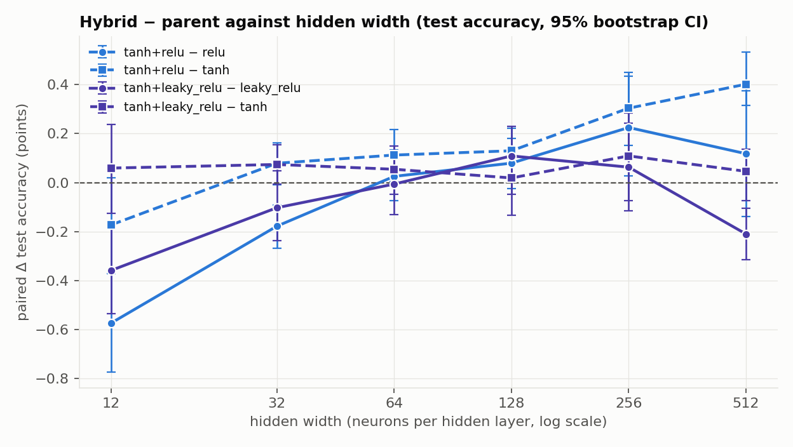
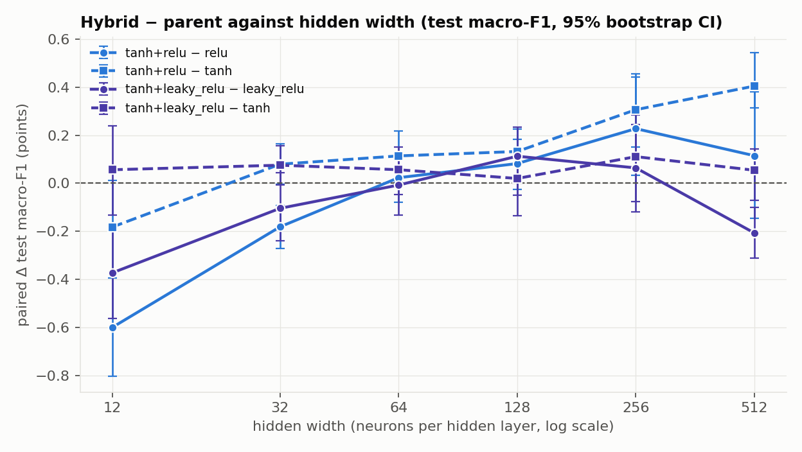
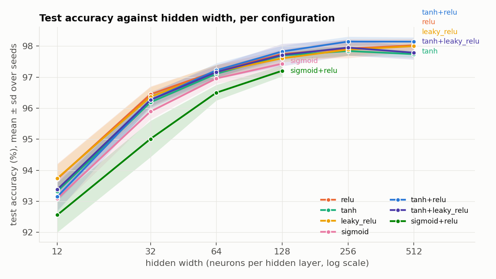

## 4. Learning-rate robustness (seed-replicated, evaluation seeds)

**12 hidden, CE — mean validation accuracy (10 seeds)**

| config | lr=0.001 | lr=0.003 | lr=0.01 | lr=0.03 | lr=0.1 | lr=0.3 |
|---|---|---|---|---|---|---|
| relu | 93.87 | 93.90 | 93.05 | 84.92 | 11.28 | 10.18 |
| tanh | 93.63 | 93.52 | 92.62 | 91.04 | 78.72 | 33.39 |
| leaky_relu | 93.67 | 93.81 | 92.99 | 92.75 | 80.48 | 82.12 |
| tanh+relu | 93.08 | 93.35 | 92.86 | 89.31 | 76.32 | 35.97 |
| tanh+leaky_relu | 93.28 | 93.54 | 93.04 | 91.84 | 76.33 | 73.96 |

**12 hidden, CE — collapsed seeds (final val acc < 50%), count / n**

| config | lr=0.001 | lr=0.003 | lr=0.01 | lr=0.03 | lr=0.1 | lr=0.3 |
|---|---|---|---|---|---|---|
| relu | 0/10 | 0/10 | 0/10 | 0/10 | 10/10 | 10/10 |
| tanh | 0/10 | 0/10 | 0/10 | 0/10 | 0/10 | 9/10 |
| leaky_relu | 0/10 | 0/10 | 0/10 | 0/10 | 0/10 | 0/10 |
| tanh+relu | 0/10 | 0/10 | 0/10 | 0/10 | 0/10 | 8/10 |
| tanh+leaky_relu | 0/10 | 0/10 | 0/10 | 0/10 | 0/10 | 0/10 |

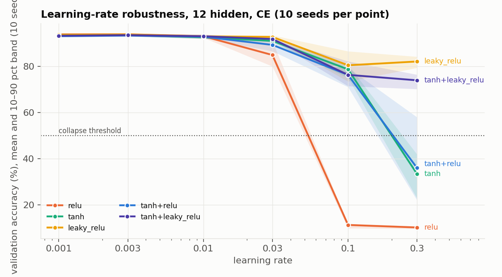

**64 hidden, CE — mean validation accuracy (10 seeds)**

| config | lr=0.001 | lr=0.003 | lr=0.01 | lr=0.03 | lr=0.1 |
|---|---|---|---|---|---|
| relu | 96.74 | 97.20 | 96.83 | 95.26 | 11.95 |
| tanh | 96.53 | 97.09 | 97.14 | 95.30 | 65.44 |
| leaky_relu | 96.53 | 97.11 | 97.03 | 95.72 | 84.87 |
| tanh+relu | 96.61 | 97.29 | 97.11 | 95.96 | 62.45 |
| tanh+leaky_relu | 96.48 | 97.17 | 97.18 | 95.71 | 84.32 |

**64 hidden, CE — collapsed seeds (final val acc < 50%), count / n**

| config | lr=0.001 | lr=0.003 | lr=0.01 | lr=0.03 | lr=0.1 |
|---|---|---|---|---|---|
| relu | 0/10 | 0/10 | 0/10 | 0/10 | 10/10 |
| tanh | 0/10 | 0/10 | 0/10 | 0/10 | 0/10 |
| leaky_relu | 0/10 | 0/10 | 0/10 | 0/10 | 0/10 |
| tanh+relu | 0/10 | 0/10 | 0/10 | 0/10 | 3/10 |
| tanh+leaky_relu | 0/10 | 0/10 | 0/10 | 0/10 | 0/10 |

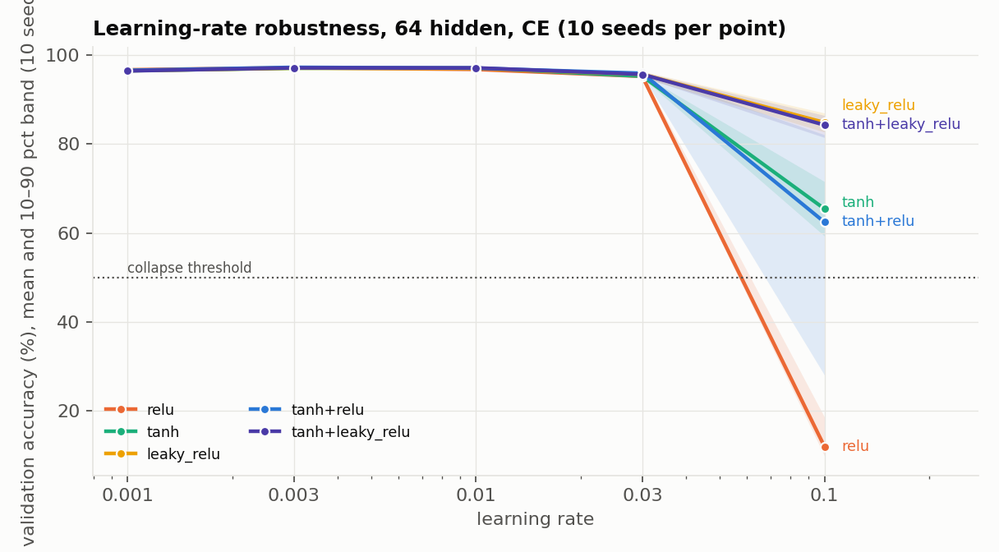

**128 hidden, CE — mean validation accuracy (10 seeds)**

| config | lr=0.001 | lr=0.003 | lr=0.01 | lr=0.03 | lr=0.1 |
|---|---|---|---|---|---|
| relu | 97.09 | 97.56 | 97.50 | 95.90 | 11.83 |
| tanh | 96.43 | 97.32 | 97.53 | 94.87 | 43.20 |
| leaky_relu | 96.91 | 97.49 | 97.38 | 94.85 | 84.74 |
| tanh+relu | 96.87 | 97.62 | 97.67 | 96.47 | 30.16 |
| tanh+leaky_relu | 96.74 | 97.55 | 97.62 | 95.57 | 84.41 |

**128 hidden, CE — collapsed seeds (final val acc < 50%), count / n**

| config | lr=0.001 | lr=0.003 | lr=0.01 | lr=0.03 | lr=0.1 |
|---|---|---|---|---|---|
| relu | 0/10 | 0/10 | 0/10 | 0/10 | 10/10 |
| tanh | 0/10 | 0/10 | 0/10 | 0/10 | 7/10 |
| leaky_relu | 0/10 | 0/10 | 0/10 | 0/10 | 0/10 |
| tanh+relu | 0/10 | 0/10 | 0/10 | 0/10 | 8/10 |
| tanh+leaky_relu | 0/10 | 0/10 | 0/10 | 0/10 | 0/10 |

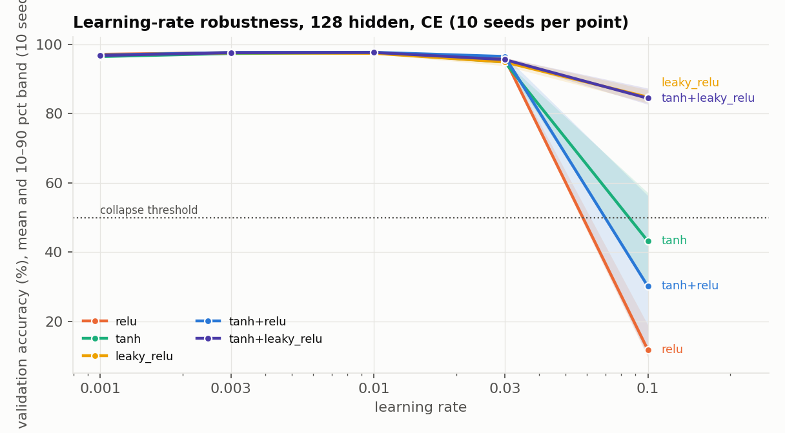

**Robustness score** — widest contiguous LR interval on the tested grid over which a config's mean validation accuracy stays within 1 point of its own best (shown as lo–hi, number of grid points, decades spanned):

| config | measure | W=12 | W=64 | W=128 |
|---|---|---|---|---|
| relu | within 1 pt of own best | 0.001–0.01 (3 pts, 1.00 dec) | 0.001–0.01 (3 pts, 1.00 dec) | 0.001–0.01 (3 pts, 1.00 dec) |
| relu | no seed collapsed | 0.001–0.03 (4 pts, 1.48 dec) | 0.001–0.03 (4 pts, 1.48 dec) | 0.001–0.03 (4 pts, 1.48 dec) |
| tanh | within 1 pt of own best | 0.001–0.003 (2 pts, 0.48 dec) | 0.001–0.01 (3 pts, 1.00 dec) | 0.003–0.01 (2 pts, 0.52 dec) |
| tanh | no seed collapsed | 0.001–0.1 (5 pts, 2.00 dec) | 0.001–0.1 (5 pts, 2.00 dec) | 0.001–0.03 (4 pts, 1.48 dec) |
| leaky_relu | within 1 pt of own best | 0.001–0.01 (3 pts, 1.00 dec) | 0.001–0.01 (3 pts, 1.00 dec) | 0.001–0.01 (3 pts, 1.00 dec) |
| leaky_relu | no seed collapsed | 0.001–0.3 (6 pts, 2.48 dec) | 0.001–0.1 (5 pts, 2.00 dec) | 0.001–0.1 (5 pts, 2.00 dec) |
| tanh+relu | within 1 pt of own best | 0.001–0.01 (3 pts, 1.00 dec) | 0.001–0.01 (3 pts, 1.00 dec) | 0.001–0.01 (3 pts, 1.00 dec) |
| tanh+relu | no seed collapsed | 0.001–0.1 (5 pts, 2.00 dec) | 0.001–0.03 (4 pts, 1.48 dec) | 0.001–0.03 (4 pts, 1.48 dec) |
| tanh+leaky_relu | within 1 pt of own best | 0.001–0.01 (3 pts, 1.00 dec) | 0.001–0.01 (3 pts, 1.00 dec) | 0.001–0.01 (3 pts, 1.00 dec) |
| tanh+leaky_relu | no seed collapsed | 0.001–0.3 (6 pts, 2.48 dec) | 0.001–0.1 (5 pts, 2.00 dec) | 0.001–0.1 (5 pts, 2.00 dec) |

## 5. Calibration LR grids (validation accuracy, mean over calibration seeds 101–103)

**12 hidden, CE — `calib_12_v2.csv`**

| config | lr=0.001 | lr=0.003 | lr=0.01 | lr=0.03 |
|---|---|---|---|---|
| relu | 93.85 | 93.89 | 93.61 | 74.23 |
| tanh | 93.95 | 94.03 | 93.07 | 91.65 |
| leaky_relu | 93.57 | 94.37 | 93.78 | 93.27 |
| sigmoid | 88.20 | 91.99 | 93.02 | 92.61 |
| tanh+relu | 93.33 | 93.55 | 92.79 | 89.47 |
| tanh+leaky_relu | 93.31 | 93.63 | 93.00 | 91.79 |
| sigmoid+relu | 90.45 | 92.03 | 92.83 | 92.39 |

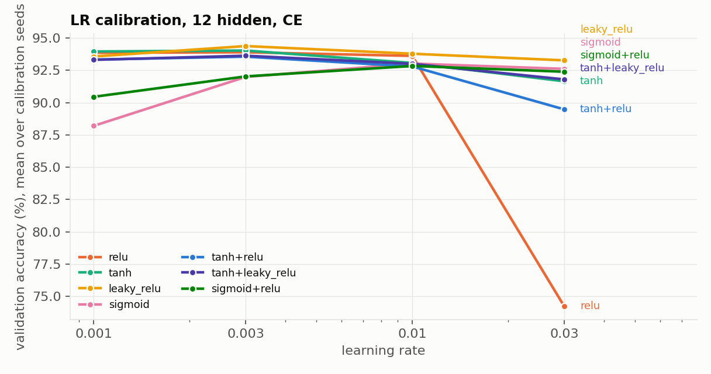

**32 hidden, CE — `calib_32.csv`**

| config | lr=0.001 | lr=0.003 | lr=0.01 | lr=0.03 |
|---|---|---|---|---|
| relu | 95.99 | 96.39 | 95.55 | 93.77 |
| tanh | 95.95 | 96.12 | 95.66 | 94.30 |
| leaky_relu | 95.90 | 96.19 | 96.15 | 95.24 |
| sigmoid | 90.42 | 94.78 | 96.01 | 96.00 |
| tanh+relu | 96.03 | 96.31 | 96.03 | 94.98 |
| tanh+leaky_relu | 95.89 | 96.52 | 96.14 | 95.03 |
| sigmoid+relu | 94.53 | 94.96 | 95.31 | 95.11 |

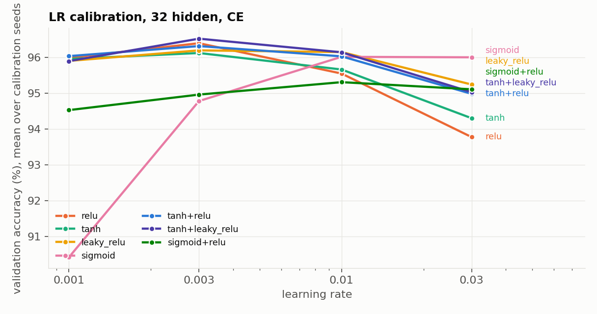

**64 hidden, CE — `calib_64.csv`**

| config | lr=0.001 | lr=0.003 | lr=0.01 | lr=0.03 |
|---|---|---|---|---|
| relu | 96.65 | 97.11 | 97.08 | 94.97 |
| tanh | 96.59 | 97.24 | 97.10 | 95.11 |
| leaky_relu | 96.51 | 97.17 | 96.79 | 95.83 |
| sigmoid | 90.99 | 95.19 | 97.04 | 97.17 |
| tanh+relu | 96.52 | 97.35 | 97.43 | 96.08 |
| tanh+leaky_relu | 96.48 | 97.15 | 97.25 | 95.70 |
| sigmoid+relu | 96.07 | 96.61 | 96.28 | 96.13 |

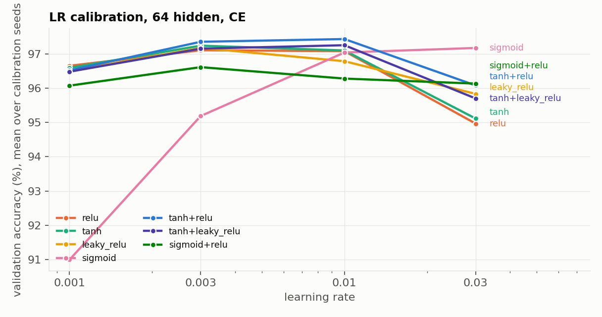

**128 hidden, CE — `calib_128_v2.csv`**

| config | lr=0.001 | lr=0.003 | lr=0.01 | lr=0.03 |
|---|---|---|---|---|
| relu | 96.97 | 97.69 | 97.41 | 95.07 |
| tanh | 96.45 | 97.49 | 97.67 | 93.87 |
| leaky_relu | 96.83 | 97.57 | 97.43 | 95.29 |
| sigmoid | 90.93 | 95.00 | 96.79 | 97.32 |
| tanh+relu | 96.77 | 97.55 | 97.72 | 96.59 |
| tanh+leaky_relu | 96.63 | 97.33 | 97.63 | 95.67 |
| sigmoid+relu | 96.49 | 97.13 | 97.13 | 96.99 |

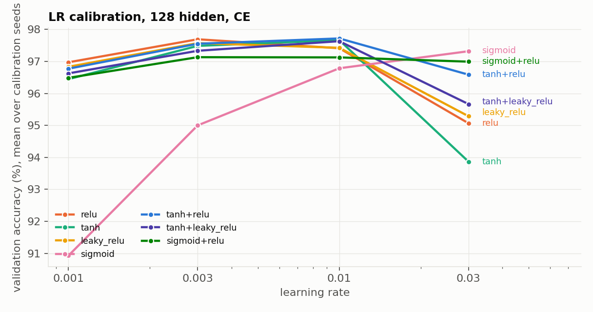

**256 hidden, CE — `calib_256.csv`**

| config | lr=0.001 | lr=0.003 | lr=0.01 | lr=0.03 |
|---|---|---|---|---|
| relu | 97.17 | 97.90 | 97.58 | 95.41 |
| tanh | 96.27 | 97.31 | 97.84 | 91.09 |
| leaky_relu | 97.07 | 97.48 | 97.69 | 77.90 |
| tanh+relu | 96.92 | 97.61 | 97.95 | 95.57 |
| tanh+leaky_relu | 96.71 | 97.36 | 97.76 | 75.65 |

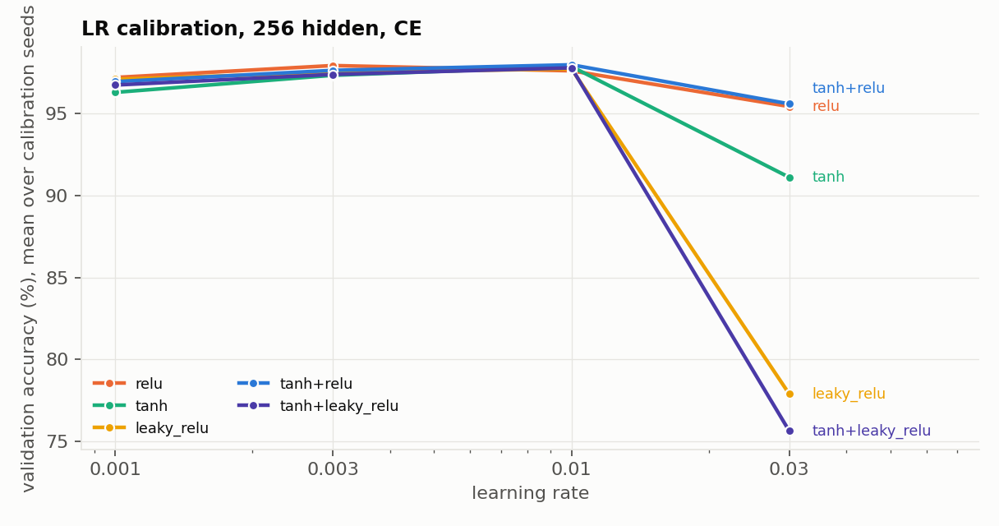

**512 hidden, CE — `calib_512.csv`**

| config | lr=0.001 | lr=0.003 | lr=0.01 | lr=0.03 |
|---|---|---|---|---|
| relu | 97.39 | 97.96 | 98.10 | 96.21 |
| tanh | 95.84 | 97.24 | 97.61 | 84.91 |
| leaky_relu | 97.23 | 97.67 | 97.67 | – |
| tanh+relu | 97.22 | 97.69 | 97.85 | – |
| tanh+leaky_relu | 96.96 | 97.73 | 97.14 | – |

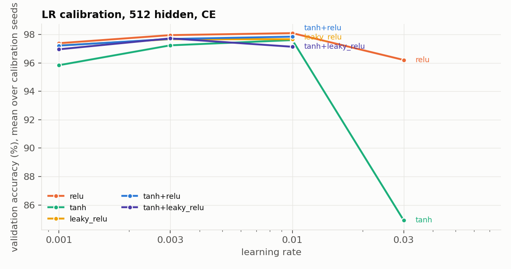

**Selected learning rate per config and width (cross-entropy), from `results/best_lr.json`**

| config | W=12 | W=32 | W=64 | W=128 | W=256 | W=512 |
|---|---|---|---|---|---|---|
| relu | 0.003 | 0.003 | 0.003 | 0.003 | 0.003 | 0.01 |
| tanh | 0.003 | 0.003 | 0.003 | 0.01 | 0.01 | 0.01 |
| leaky_relu | 0.003 | 0.003 | 0.003 | 0.003 | 0.01 | 0.003 |
| sigmoid | 0.01 | 0.01 | 0.03 | 0.03 | – | – |
| tanh+relu | 0.003 | 0.003 | 0.01 | 0.01 | 0.01 | 0.01 |
| tanh+leaky_relu | 0.003 | 0.003 | 0.01 | 0.01 | 0.01 | 0.003 |
| sigmoid+relu | 0.01 | 0.01 | 0.003 | 0.003 | – | – |

## 6. Layout and ratio

**12 hidden, CE — `layout_12.csv`.** Each pair uses the LR calibrated for its interleave/0.5 variant, so ratios 0.25 and 0.75 are not separately tuned.

| pair | layout | ratio | lr | n | test acc mean ± sd | test macro-F1 mean ± sd | Δ acc vs non-tanh parent | Δ acc vs tanh | Δ acc vs interleave 0.5 |
|---|---|---|---|---|---|---|---|---|---|
| tanh+relu | block | 0.5 | 0.001 | 20 | 93.58 ± 0.36 | 93.51 ± 0.36 | -0.22 [-0.44, +0.02] | +0.28 [+0.10, +0.47] | – |
| tanh+relu | interleave | 0.25 | 0.001 | 20 | 93.45 ± 0.27 | 93.39 ± 0.27 | -0.35 [-0.55, -0.14] | +0.16 [-0.01, +0.31] | – |
| tanh+relu | interleave | 0.75 | 0.001 | 20 | 93.59 ± 0.47 | 93.53 ± 0.47 | -0.20 [-0.48, +0.05] | +0.30 [+0.06, +0.53] | – |
| tanh+relu | random | 0.5 | 0.001 | 20 | 93.47 ± 0.33 | 93.40 ± 0.33 | -0.33 [-0.55, -0.10] | +0.18 [-0.04, +0.38] | – |

**128 hidden, CE — `layout_128.csv`.** Each pair uses the LR calibrated for its interleave/0.5 variant, so ratios 0.25 and 0.75 are not separately tuned.

| pair | layout | ratio | lr | n | test acc mean ± sd | test macro-F1 mean ± sd | Δ acc vs non-tanh parent | Δ acc vs tanh | Δ acc vs interleave 0.5 |
|---|---|---|---|---|---|---|---|---|---|
| tanh+leaky_relu | block | 0.5 | 0.01 | 10 | 97.78 ± 0.17 | 97.76 ± 0.17 | +0.19 [+0.05, +0.34] | +0.08 [-0.05, +0.19] | +0.03 [-0.08, +0.14] |
| tanh+leaky_relu | interleave | 0.25 | 0.01 | 10 | 97.72 ± 0.11 | 97.70 ± 0.11 | +0.13 [+0.05, +0.20] | +0.01 [-0.06, +0.09] | -0.03 [-0.14, +0.09] |
| tanh+leaky_relu | interleave | 0.5 | 0.01 | 10 | 97.75 ± 0.11 | 97.73 ± 0.11 | +0.16 [+0.05, +0.27] | +0.05 [-0.05, +0.13] | +0.00 [+0.00, +0.00] |
| tanh+leaky_relu | interleave | 0.75 | 0.01 | 10 | 97.60 ± 0.14 | 97.57 ± 0.15 | +0.01 [-0.09, +0.11] | -0.10 [-0.24, +0.00] | -0.15 [-0.27, -0.05] |
| tanh+leaky_relu | random | 0.5 | 0.01 | 10 | 97.85 ± 0.16 | 97.83 ± 0.17 | +0.26 [+0.13, +0.40] | +0.15 [+0.01, +0.29] | +0.10 [-0.01, +0.21] |
| tanh+relu | block | 0.5 | 0.01 | 10 | 97.87 ± 0.09 | 97.85 ± 0.09 | +0.13 [+0.02, +0.23] | +0.17 [+0.06, +0.27] | -0.01 [-0.09, +0.08] |
| tanh+relu | interleave | 0.25 | 0.01 | 10 | 97.82 ± 0.11 | 97.79 ± 0.12 | +0.07 [-0.01, +0.14] | +0.11 [+0.03, +0.18] | -0.06 [-0.16, +0.03] |
| tanh+relu | interleave | 0.5 | 0.01 | 10 | 97.88 ± 0.15 | 97.86 ± 0.14 | +0.13 [+0.01, +0.24] | +0.17 [+0.05, +0.28] | +0.00 [+0.00, +0.00] |
| tanh+relu | interleave | 0.75 | 0.01 | 10 | 97.76 ± 0.27 | 97.74 ± 0.27 | +0.01 [-0.17, +0.18] | +0.05 [-0.14, +0.22] | -0.12 [-0.23, -0.01] |
| tanh+relu | random | 0.5 | 0.01 | 10 | 97.77 ± 0.24 | 97.74 ± 0.25 | +0.02 [-0.13, +0.16] | +0.06 [-0.08, +0.20] | -0.11 [-0.23, -0.02] |

**256 hidden, CE — `layout_256.csv`.** Each pair uses the LR calibrated for its interleave/0.5 variant, so ratios 0.25 and 0.75 are not separately tuned.

| pair | layout | ratio | lr | n | test acc mean ± sd | test macro-F1 mean ± sd | Δ acc vs non-tanh parent | Δ acc vs tanh | Δ acc vs interleave 0.5 |
|---|---|---|---|---|---|---|---|---|---|
| tanh+leaky_relu | block | 0.5 | 0.01 | 6 | 97.86 ± 0.38 | 97.84 ± 0.39 | +0.02 [-0.11, +0.16] | -0.02 [-0.24, +0.18] | -0.00 [-0.36, +0.30] |
| tanh+leaky_relu | interleave | 0.25 | 0.01 | 6 | 98.00 ± 0.19 | 97.98 ± 0.20 | +0.16 [+0.06, +0.25] | +0.12 [+0.02, +0.21] | +0.14 [-0.11, +0.42] |
| tanh+leaky_relu | interleave | 0.5 | 0.01 | 6 | 97.87 ± 0.22 | 97.84 ± 0.23 | +0.02 [-0.24, +0.28] | -0.02 [-0.24, +0.18] | +0.00 [+0.00, +0.00] |
| tanh+leaky_relu | interleave | 0.75 | 0.01 | 6 | 97.84 ± 0.30 | 97.81 ± 0.30 | -0.00 [-0.28, +0.25] | -0.04 [-0.29, +0.18] | -0.03 [-0.21, +0.21] |
| tanh+leaky_relu | random | 0.5 | 0.01 | 6 | 97.86 ± 0.50 | 97.84 ± 0.50 | +0.02 [-0.48, +0.50] | -0.02 [-0.48, +0.37] | -0.00 [-0.29, +0.25] |
| tanh+relu | block | 0.5 | 0.01 | 6 | 98.18 ± 0.14 | 98.16 ± 0.14 | +0.34 [+0.18, +0.53] | +0.30 [+0.11, +0.42] | +0.05 [-0.10, +0.21] |
| tanh+relu | interleave | 0.25 | 0.01 | 6 | 98.03 ± 0.16 | 98.01 ± 0.16 | +0.18 [-0.05, +0.46] | +0.15 [+0.03, +0.28] | -0.10 [-0.25, +0.04] |
| tanh+relu | interleave | 0.5 | 0.01 | 6 | 98.13 ± 0.18 | 98.10 ± 0.18 | +0.28 [-0.00, +0.58] | +0.25 [+0.02, +0.48] | +0.00 [+0.00, +0.00] |
| tanh+relu | interleave | 0.75 | 0.01 | 6 | 98.20 ± 0.18 | 98.18 ± 0.18 | +0.36 [+0.16, +0.58] | +0.32 [+0.15, +0.47] | +0.07 [-0.08, +0.25] |
| tanh+relu | random | 0.5 | 0.01 | 6 | 98.02 ± 0.30 | 98.00 ± 0.30 | +0.17 [-0.20, +0.52] | +0.14 [-0.17, +0.42] | -0.11 [-0.36, +0.12] |

## 7. Replication under the original loss (MSE, uniform sigmoid output)

**12 hidden, MSE — `mse_12.csv` (20 seeds)**

| config | lr | n | test acc mean ± sd | median | test macro-F1 mean ± sd | val acc mean |
|---|---|---|---|---|---|---|
| relu | 0.003 | 20 | 93.13 ± 0.38 | 93.23 | 93.06 ± 0.38 | 92.77 |
| tanh | 0.01 | 20 | 92.49 ± 0.50 | 92.62 | 92.41 ± 0.51 | 92.08 |
| tanh+relu | 0.01 | 20 | 92.66 ± 0.51 | 92.64 | 92.59 ± 0.51 | 92.36 |

| comparison | metric | n | mean Δ (hybrid − parent) | 95% bootstrap CI | hybrid wins | paired t p | Wilcoxon p |
|---|---|---|---|---|---|---|---|
| tanh+relu vs relu | accuracy | 20 | -0.47 | [-0.73, -0.20] | 3/20 | 0.003 | 0.005 |
| tanh+relu vs relu | macro-F1 | 20 | -0.46 | [-0.72, -0.19] | 3/20 | 0.003 | 0.004 |
| tanh+relu vs tanh | accuracy | 20 | +0.17 | [-0.13, +0.49] | 13/20 | 0.299 | 0.334 |
| tanh+relu vs tanh | macro-F1 | 20 | +0.18 | [-0.13, +0.50] | 14/20 | 0.283 | 0.294 |

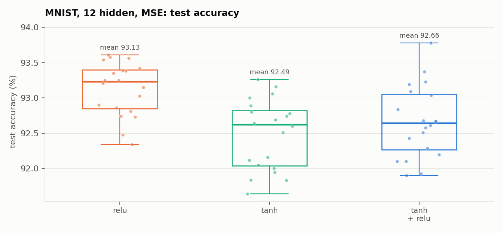

MSE calibration grid, 12 hidden (validation accuracy, mean over calibration seeds):

| config | lr=0.003 | lr=0.01 | lr=0.03 |
|---|---|---|---|
| relu | 92.61 | 92.21 | 75.96 |
| tanh | 91.64 | 92.05 | 90.89 |
| tanh+relu | 92.50 | 92.73 | 92.57 |

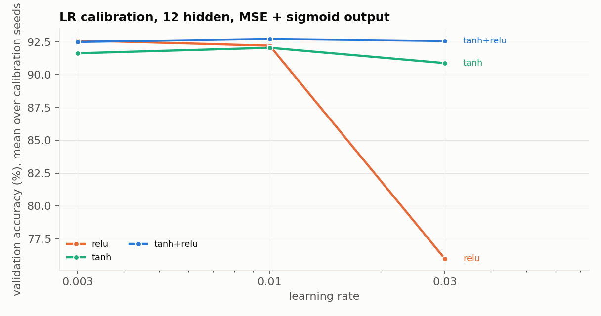

**128 hidden, MSE — `mse_128.csv` (10 seeds)**

| config | lr | n | test acc mean ± sd | median | test macro-F1 mean ± sd | val acc mean |
|---|---|---|---|---|---|---|
| relu | 0.01 | 10 | 97.86 ± 0.14 | 97.88 | 97.83 ± 0.14 | 97.74 |
| tanh | 0.03 | 10 | 97.43 ± 0.20 | 97.45 | 97.41 ± 0.20 | 97.48 |
| tanh+relu | 0.01 | 10 | 97.62 ± 0.11 | 97.61 | 97.60 ± 0.11 | 97.57 |

| comparison | metric | n | mean Δ (hybrid − parent) | 95% bootstrap CI | hybrid wins | paired t p | Wilcoxon p |
|---|---|---|---|---|---|---|---|
| tanh+relu vs relu | accuracy | 10 | -0.24 | [-0.34, -0.13] | 1/10 | 0.002 | 0.006 |
| tanh+relu vs relu | macro-F1 | 10 | -0.24 | [-0.34, -0.13] | 1/10 | 0.002 | 0.006 |
| tanh+relu vs tanh | accuracy | 10 | +0.19 | [+0.06, +0.34] | 7/10 | 0.036 | 0.020 |
| tanh+relu vs tanh | macro-F1 | 10 | +0.19 | [+0.05, +0.34] | 8/10 | 0.037 | 0.037 |

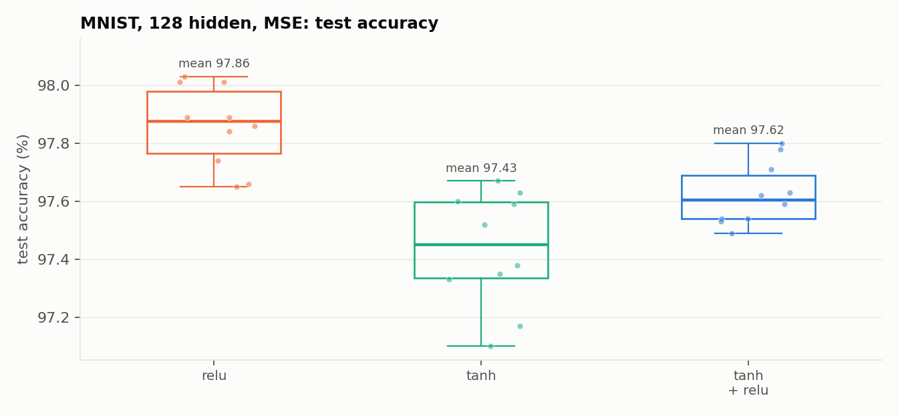

MSE calibration grid, 128 hidden (validation accuracy, mean over calibration seeds):

| config | lr=0.003 | lr=0.01 | lr=0.03 |
|---|---|---|---|
| relu | 97.03 | 97.62 | 97.46 |
| tanh | 96.27 | 97.13 | 97.17 |
| tanh+relu | 96.85 | 97.51 | 97.41 |

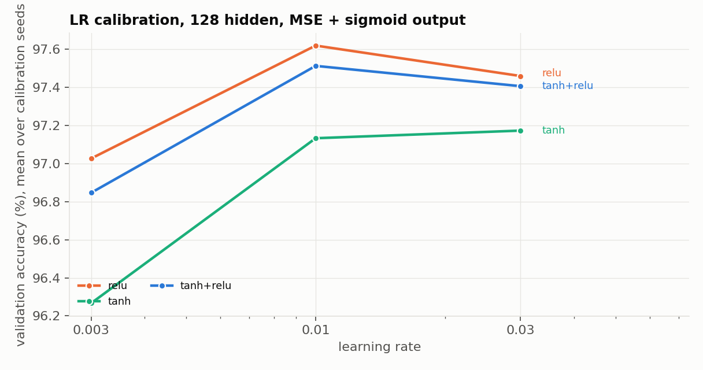

## 8. Rejected rows

No row was rejected: every run in every CSV has `status=ok` and a complete confusion matrix.

